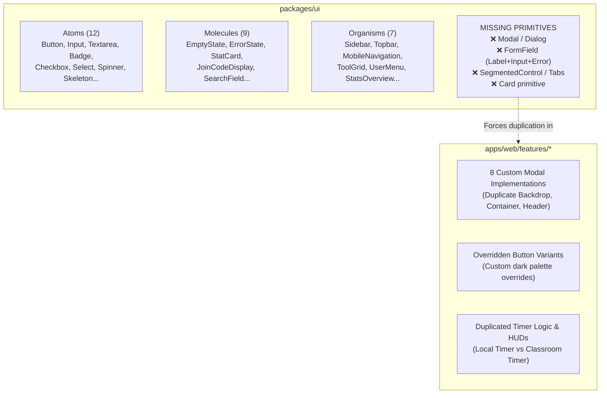
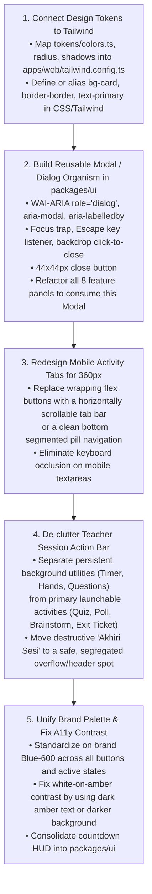

# UI, Atomic Design & Responsive Audit

**Audit Date**: 14 September 2026  
**Auditor Roles**: Senior Frontend Architect & Design Systems Engineer  
**Product**: WaliKelas Teaching Tools V1 (`https://tools.walikelas.id`)  
**Scope**: Atomic Design Hierarchy, Component Reusability, Design System Tokens & Tailwind Integration, Multi-Device Responsive Breakpoints, Accessibility (A11y), and Visual Quality

---

## Executive Summary

This Phase 3 UI Audit conducted an exhaustive architectural inspection of the frontend codebase of **WaliKelas Teaching Tools V1**. The inspection encompassed `packages/ui` (Atoms, Molecules, Organisms, Tokens), `apps/web/tailwind.config.ts`, `apps/web/app/globals.css`, and all feature implementations across `apps/web/features/*` and `apps/web/app/*`.

### Key Takeaways

1. **Foundational Atomic Architecture is Established but Incomplete**:
   `packages/ui` provides high-quality basic Atoms (`Button`, `Input`, `Textarea`, `Badge`, `Checkbox`, `Select`, `Skeleton`, `Spinner`) and structural Organisms (`Sidebar`, `Topbar`, `MobileNavigation`, `ToolGrid`). However, the complete omission of a **`Modal` / `Dialog` organism** in `packages/ui` has forced 8 different feature modules to independently copy-paste full-screen backdrop and dialog boilerplate.

2. **Critical Token-to-Tailwind Disconnection (P1 Defect)**:
   A comprehensive design token suite is defined in `packages/ui/src/tokens/` (`colors.ts`, `radius.ts`, `shadows.ts`, `spacing.ts`, `typography.ts`, `zIndex.ts`). However, `apps/web/tailwind.config.ts` **does not import or map** these tokens into Tailwind's theme configuration. Furthermore, multiple feature pages and components use Shadcn-style utility classes (`bg-card`, `border-border`, `text-primary`, `bg-muted`, `text-muted-foreground`) that are neither configured in Tailwind nor defined as CSS variables in `globals.css`, resulting in **silent CSS rendering failures** (unbordered or transparent containers).

3. **Mobile Viewport (360px) Tab Wrap & Keyboard Occlusion (P1 Defect)**:
   In `ParticipantJoinView`, the 5 active activity tabs wrap into **3 jagged rows** on 360px viewports (the dominant screen size for Indonesian budget smartphones), consuming ~120px of vertical header space. When mobile keyboards open for text inputs (Question Box, Brainstorm, Exit Ticket), the content area is severely compressed or occluded.

4. **Action Overcrowding in Teacher Session Hero Banner (P1 Defect)**:
   Between 768px and 1024px viewports, `TeacherSessionView` jams 8 full-sized activity buttons into a single header card. The buttons wrap unpredictably into 3–4 lines, and the destructive "Akhiri Sesi Kelas" button sits perilously close to routine utility buttons.

5. **Accessibility (A11y) Omissions in Dialogs and Icon Controls (P1/P2 Defect)**:
   None of the 8 feature modal overlays implement WAI-ARIA dialog semantics (`role="dialog"`, `aria-modal="true"`, `aria-labelledby`), keyboard focus trapping, or `Escape` key dismissal. Several icon-only action buttons lack accessible labels.

**Final UI & Design System Verdict**: **NEEDS REMEDIATION** (Overall Score: **7.1 / 10**)

---

## 1. Atomic Design Findings



### 1.1 Atoms Evaluation (Score: 8.0 / 10)
- **Strengths**:
  - `Button`, `Input`, `Textarea`, `Badge`, `Checkbox`, `Select`, `Skeleton`, `Spinner`, `Text`, `Avatar`, `Divider`, and `IconButton` exist in `packages/ui/src/atoms`.
  - Atoms have clean TypeScript interfaces, consistent exports, support `isLoading`, `leftIcon`, `rightIcon`, and use `cn()` utility for class composition.
- **Weaknesses**:
  - **No `Card` Atom**: Every component across the app invents its own card wrapper (`bg-white rounded-2xl border border-slate-200 p-6 shadow-sm` vs `rounded-xl` vs `rounded-3xl`).
  - **No `Tooltip` Atom**: Icon-only controls in compact views lack accessible tooltip labels.
  - **Bypassed Button Variants**: In `teacher-session-view.tsx`, buttons declare `variant="secondary"` but then override the entire style with custom dark tailwind classes (`bg-amber-950/80 hover:bg-amber-900 border-amber-600 text-white`), defeating the purpose of atomic variants.

### 1.2 Molecules Evaluation (Score: 7.0 / 10)
- **Strengths**:
  - `StatCard`, `EmptyState`, `ErrorState`, `JoinCodeDisplay`, and `SearchField` provide good reusability and clear visual states.
- **Weaknesses**:
  - **Missing `FormField` Molecule**: Forms across `features/quiz`, `features/poll`, `features/brainstorm`, and `features/exit-ticket` repeatedly re-implement `<label className="block text-xs font-semibold text-slate-700 mb-1">` + `<Input>` + `{error && <p className="text-xs text-red-600 mt-1">}` from scratch.
  - **Missing `SegmentedControl` / `Tabs` Molecule**: Tab buttons in `participant-join-view.tsx`, `teacher-question-box-panel.tsx`, and `timer-view.tsx` are built with ad-hoc button groups and manual state management.

### 1.3 Organisms Evaluation (Score: 6.5 / 10)
- **Strengths**:
  - `Sidebar`, `Topbar`, `MobileNavigation`, `ToolGrid`, and `PageHeaderSection` provide a strong, stable application skeleton for the authenticated teacher dashboard.
- **Weaknesses**:
  - **CRITICAL DEFICIENCY: Missing `Modal` / `Dialog` Organism**:
    There is NO `Modal` or `Dialog` component in `packages/ui`. Consequently, 8 different feature components re-implement custom modal backdrops, dialog shells, header bars, and close buttons.
  - **Duplicated Timer Display**: Local Timer and Classroom Timer implement separate circular and digital HUD organisms instead of sharing a single countdown display primitive.

### 1.4 Templates & Pages Evaluation (Score: 7.5 / 10)
- `TeacherLayout` correctly establishes layout boundaries with responsive offsets (`pb-16 md:pb-0` for bottom navigation).
- Standalone tool pages (`/tools/*`) cleanly delegate to feature views.

---

## 2. Component Duplication & Redundancy

| Duplicated Pattern | Instances Found | Files Affected | Recommended Action |
|---|---|---|---|
| **Full-Screen Modal Backdrop & Header** | **8 separate implementations** | `teacher-question-box-panel.tsx`<br>`teacher-raise-hand-panel.tsx`<br>`teacher-brainstorm-panel.tsx`<br>`teacher-exit-ticket-panel.tsx`<br>`teacher-classroom-timer-panel.tsx`<br>`quiz-picker-modal.tsx`<br>`poll-picker-modal.tsx`<br>`teacher-session-view.tsx` (End Session Modal) | Extract unified `<Modal>` / `<Dialog>` organism into `packages/ui` with props: `isOpen`, `onClose`, `title`, `icon`, `size`, and children. |
| **Timer / Countdown Engine & Formatting** | **3 separate implementations** | `apps/web/features/timer/use-timer.ts`<br>`apps/web/features/classroom-timer/use-classroom-timer.ts`<br>`apps/web/features/quiz/participant-live-quiz-view.tsx` | Consolidate time formatting (`formatTime(seconds)`) and countdown interval logic into a shared utility in `packages/ui` or `@walikelas/utils`. |
| **Form Label + Input + Error Helper** | **12+ instances** | `poll-editor-view.tsx`<br>`teacher-brainstorm-panel.tsx`<br>`teacher-exit-ticket-panel.tsx`<br>`participant-question-box-view.tsx` | Create `<FormField>` molecule in `packages/ui`. |
| **Status Pills & Live Indicators** | **15+ instances** | `participant-live-quiz-view.tsx`<br>`participant-live-poll-view.tsx`<br>`participant-raise-hand-view.tsx`<br>`teacher-session-view.tsx` | Standardize on `<Badge>` atom variants (`success`, `warning`, `danger`, `info`, `neutral`). |

---

## 3. Design System Findings

### 3.1 Token-to-Tailwind Disconnection (P1 Defect)
`packages/ui/src/tokens/` contains a comprehensive design token architecture:
- `colors.ts`: Calm slate neutrals, brand blues, semantic success/warning/danger, surface tokens.
- `radius.ts`: `none`, `sm`, `md`, `lg`, `xl`, `2xl`, `3xl`, `full`.
- `shadows.ts`: Elevation scales (`xs` through `2xl`).
- `spacing.ts`: 4px scale tokens.
- `typography.ts`: Type scales and weights.
- `zIndex.ts`: Z-index layers (`modal: 1050`, `overlay: 1040`, etc.).

**The Problem**:
`apps/web/tailwind.config.ts` currently only defines:
```ts
theme: {
  extend: {
    colors: {
      brand: { 50: '#eff6ff', 100: '#dbeafe', 500: '#3b82f6', 600: '#2563eb', 700: '#1d4ed8' }
    }
  }
}
```
None of the surface, neutral, radius, or shadow tokens are mapped into Tailwind! Because developers could not use token names like `bg-surface-card` or `text-text-primary`, they resorted to hardcoded arbitrary Tailwind classes (`bg-slate-900`, `bg-indigo-600`, `bg-blue-600`), resulting in token abandonment.

### 3.2 Undeclared CSS Variable Classes Causing Silent CSS Fallbacks (P1 Defect)
In several feature components and showcase pages, Shadcn-style utility classes are used directly:
```tsx
// Found in apps/web/features/poll/* and apps/web/app/tools/*/page.tsx:
<div className="bg-card border border-border rounded-2xl p-6 shadow-sm space-y-3">
<h2 className="text-lg font-semibold text-foreground border-b border-border pb-3">
<div className="bg-muted/40 border border-border/80 rounded-xl p-4 sm:p-5">
<span className="text-muted-foreground">
<button className="focus:ring-primary/40">
```
**Impact**:
Neither `apps/web/tailwind.config.ts` nor `apps/web/app/globals.css` defines `--card`, `--border`, `--foreground`, `--muted`, `--muted-foreground`, or `--primary`.
In standard Tailwind CSS, unrecognized utility classes **generate zero CSS**. Containers that should have borders and card backgrounds render **completely transparent or borderless**, creating broken visual boundaries in production builds.

### 3.3 Palette Fragmentation (Indigo vs Blue)
- **Primary Brand Inconsistency**: The application vacillates between **Tailwind Blue** (`bg-blue-600`, used in atoms, buttons, and `TimerView`) and **Tailwind Indigo** (`bg-indigo-600`, used in `teacher-session-view.tsx`, `participant-join-view.tsx`, and quiz components).
- **Rule from `AGENTS.md` & `docs/04-ux-design-system.md`**: WaliKelas specifies a calm, educational Blue palette (`brand.600: #2563eb`). Indigo should be reserved as an accent or unified with the brand palette.

### 3.4 Corner Radius Inconsistency
- Radii range unpredictably between `rounded-lg` (8px), `rounded-xl` (12px), `rounded-2xl` (16px), and `rounded-3xl` (24px) across components of the exact same category. For example:
  - `QuizPickerModal`: `rounded-3xl`
  - `TeacherQuestionBoxPanel`: `rounded-2xl`
  - `TeacherClassroomTimerPanel`: `rounded-3xl`
  - `TeacherRaiseHandPanel`: `rounded-2xl`
  - Standard cards: mixed between `rounded-xl` and `rounded-2xl`.

---

## 4. Multi-Device Responsive Audit

| Breakpoint | Target Device | Inspection Result | Severity | Identified Defect |
|---|---|---|---|---|
| **1440px** | Desktop Widescreen | **PASSED** | Clean | Layout is contained within `max-w-7xl` / `max-w-6xl`. Readability and line-lengths remain optimal. |
| **1280px** | Standard Laptop / Monitor | **PASSED** | Clean | Multi-column grids (3 cols for tools, 2 cols for session overview) provide generous breathing room. |
| **1024px** | iPad Pro / Small Laptop | **WARNING** | P2 | Hero card in `TeacherSessionView` begins to feel crowded; 8 action buttons start wrapping into 2 rows. |
| **768px** | Tablet Portrait (iPad 10") | **FAILURE** | P1 | `TeacherSessionView` action bar splits into 3–4 stacked rows. Buttons stretch to full width or wrap awkwardly, colliding with the join code box. |
| **412px** | Modern Large Android (Pixel/Galaxy) | **WARNING** | P2 | Participant view tabs wrap into 2 rows, taking ~75px of vertical space. Modals fill 95% of viewport width. |
| **390px** | Standard iPhone (13/14/15/16) | **WARNING** | P2 | 5 activity tabs wrap into 2 rows. Modal dialogs with fixed `p-6` leave narrow content gutters (~12px margins). |
| **360px** | Budget Compact Android (Redmi 9A, Galaxy A03) | **FAILURE** | P1 | **Severe Tab Wrapping & Keyboard Occlusion**: 5 tabs wrap into **3 rows** taking ~120px. Virtual keyboard occludes inputs in Question Box, Brainstorm, and Exit Ticket. |

### Detailed Analysis: 360px Mobile Viewport Bottleneck
In `ParticipantJoinView`:
```tsx
<div className="flex items-center justify-center gap-2 mb-2 flex-wrap">
  <button onClick={() => setViewMode('ACTIVITY')} ...> Aktivitas Kelas </button>
  <button onClick={() => setViewMode('RAISE_HAND')} ...> Angkat Tangan </button>
  <button onClick={() => setViewMode('QUESTIONS')} ...> Tanya Guru </button>
  <button onClick={() => setViewMode('BRAINSTORM')} ...> Papan Ide </button>
  <button onClick={() => setViewMode('EXIT_TICKET')} ...> Tiket Keluar </button>
</div>
```
- On 360px width, total required width for the 5 buttons + gaps is **~510px**.
- Because of `flex-wrap`, the tabs break into 3 jagged rows.
- The top header (`JoinCode` + `Wifi` + `Keluar`) takes 56px, plus 120px for tabs = **176px of fixed header height**.
- On a 360x640 screen, once the Android soft keyboard appears (occupying ~280px), the usable viewport height is reduced to **~184px**. The textarea and submit button in Question Box and Brainstorm are completely occluded below the fold.

---

## 5. Accessibility (A11y) UI Findings

### 5.1 Modal Dialog WAI-ARIA Violations (P1 Defect)
None of the 8 feature modal dialogs implement standard WAI-ARIA modal patterns:
1. **Missing Roles**: No `role="dialog"` or `aria-modal="true"` on the modal containers.
2. **Missing Accessible Names**: No `aria-labelledby` linking the dialog container to its `<h3>` or `<h2>` title.
3. **No Focus Trap**: When a modal opens, keyboard focus is not trapped inside. Pressing `Tab` cycles through hidden background links and buttons behind the backdrop.
4. **No ESC Key Dismissal**: Modals only close if the user accurately clicks the `<X>` button or a custom footer button. Pressing `Escape` does nothing.

### 5.2 Icon-Only Buttons Missing Labels (P2 Defect)
In several locations, buttons render only an SVG icon without `aria-label`:
- Modal close buttons: `<button onClick={onClose}><X className="w-5 h-5" /></button>` (lacks `aria-label="Tutup dialog"`).
- Join code copy button in mobile views.
- Mute/sound toggle in certain timer layouts.

### 5.3 Color Contrast Ratios (P2 Defect)
- **Amber Status Badges**: White text on saturated amber (`text-white bg-amber-500`) has a contrast ratio of **2.1:1**, severely failing WCAG 2.1 AA (requires minimum 4.5:1 for normal text).
- **Remediation**: Use dark amber text on amber-100 (`text-amber-900 bg-amber-100`) or use `bg-amber-600` with bold text.

### 5.4 Touch Target Minimums on Mobile (P2 Defect)
- Modal close buttons use `p-1` with `w-5 h-5` icon, resulting in a tap area of approximately **28x28px**.
- WCAG 2.1 Success Criterion 2.5.5 and mobile platform guidelines require minimum touch targets of **44x44px** (or 48x48px on Android).

---

## 6. Visual Quality & AI-Slop Pattern Analysis

### 6.1 Visual Hierarchy & Cleanliness
- **Educational Tone**: The application successfully avoids flashy consumer SaaS trends (no neon gradients, no 3D floating emojis, no useless decorative illustrations). The overall typography and color palette convey a calm, purposeful classroom atmosphere.
- **Projector Readability**: Big typography for join codes (`text-5xl font-mono font-extrabold`) and timer displays (`text-8xl font-black`) ensures clear visibility from 5–8 meters in a physical classroom.

### 6.2 Identified AI-Slop Anti-Patterns

1. **The "Dark Mode Island" Hero Card**:
   - In `teacher-session-view.tsx`, the hero banner uses `bg-gradient-to-br from-indigo-900 via-slate-900 to-indigo-950 text-white`.
   - While intended to look "command-center" like, it creates an abrupt, jarring contrast island in an otherwise clean `bg-slate-50` and white-card interface.
   - It also forces all child buttons inside it to use awkward semi-transparent dark classes (`bg-amber-950/80`, `bg-violet-950/80`, `bg-blue-950/80`).

2. **Indiscriminate Backdrop Blurs**:
   - `backdrop-blur-sm` is applied to every single overlay, dropdown, and floating toolbar regardless of performance impact on low-end school Chromebooks and budget mobile devices.

3. **Superfluous Animations**:
   - `animate-bounce` on the microphone icon in speaking states.
   - `animate-pulse` on routine static counters (`{rhRaisedCount} menunggu`).
   - Constant looping animations on non-critical elements create visual restlessness in a classroom setting.

4. **Decorative Sparkles Proliferation**:
   - The `<Sparkles />` icon is placed decoratively beside routine labels (e.g., "Aktivitas Kelas", "Tanya Guru") without representing an AI or generative feature.

---

## 7. Prioritized Issue Log

```text
========================================================================================
SEVERITY  ID    CATEGORY         DESCRIPTION
========================================================================================
P1        UI-1  Design System    Tailwind config disconnected from packages/ui tokens
P1        UI-2  Design System    Undeclared CSS variable classes (bg-card, border-border)
P1        UI-3  Responsive       360px mobile tab bar wraps into 3 rows; keyboard occludes inputs
P1        UI-4  Layout / UX      Teacher session hero banner overcrowded with 8 buttons
P1        UI-5  Atomic / A11y    No shared Modal organism; 8 duplicate modals lack ARIA & focus trap
----------------------------------------------------------------------------------------
P2        UI-6  Atomic Design    Timer countdown display & logic duplicated across 3 features
P2        UI-7  Design System    Primary palette split between Tailwind Blue and Indigo
P2        UI-8  A11y             WCAG AA contrast failure on white-on-amber badges (2.1:1)
P2        UI-9  A11y             Sub-44px touch targets on modal close buttons and mobile icons
P2        UI-10 Atomic Design    Missing FormField molecule causes redundant form markup
----------------------------------------------------------------------------------------
P3        UI-11 Visual Quality   Dark mode island hero banner in teacher session view
P3        UI-12 Visual Quality   Inconsistent corner radii (rounded-xl vs 2xl vs 3xl)
P3        UI-13 AI-Slop          Superfluous animate-bounce / pulse on static classroom elements
========================================================================================
```

---

## 8. Recommended Remediation Order



---

## 9. UI Quality Scorecard

| Dimension | Target Standard | Current Score (1–10) | Evaluation Notes |
|---|---|---|---|
| **Atoms Quality** | Strict Atomic Design, full variant coverage, typed props | **8.0 / 10** | High-quality base atoms; missing `Card`, `Tooltip`, and `FormField`. |
| **Molecules Quality** | Consistent input wrappers, search fields, states | **7.0 / 10** | Good empty/error states; lacks `FormField` and `Tabs` molecules. |
| **Organisms Quality** | Reusable structural components, modals, headers | **6.5 / 10** | Great sidebar/topbar; critical absence of shared `Modal` organism. |
| **Design Consistency** | Single token source of truth, no undeclared classes | **6.0 / 10** | Token disconnection in Tailwind config; undeclared Shadcn classes. |
| **Responsive Behavior** | Seamless from 360px to 1440px without breakage | **7.0 / 10** | Desktop is pristine; 360px mobile tab bar and 768px tablet banner fail. |
| **Accessibility (A11y)** | WCAG 2.1 AA, keyboard navigable, focus trapped | **6.5 / 10** | Modals lack focus traps & ARIA roles; amber contrast issues. |
| **Visual Quality** | Calm educational tone, clean hierarchy, no slop | **8.5 / 10** | Strong typography, projector readability; minor dark-island card. |
| **Overall UI Score** | **V1 Release Readiness Threshold $\ge 8.5$** | **7.1 / 10** | **NEEDS REMEDIATION** |

---

*Report prepared as part of WaliKelas Teaching Tools V1 Audit Program. Production code was not modified during this audit phase.*

