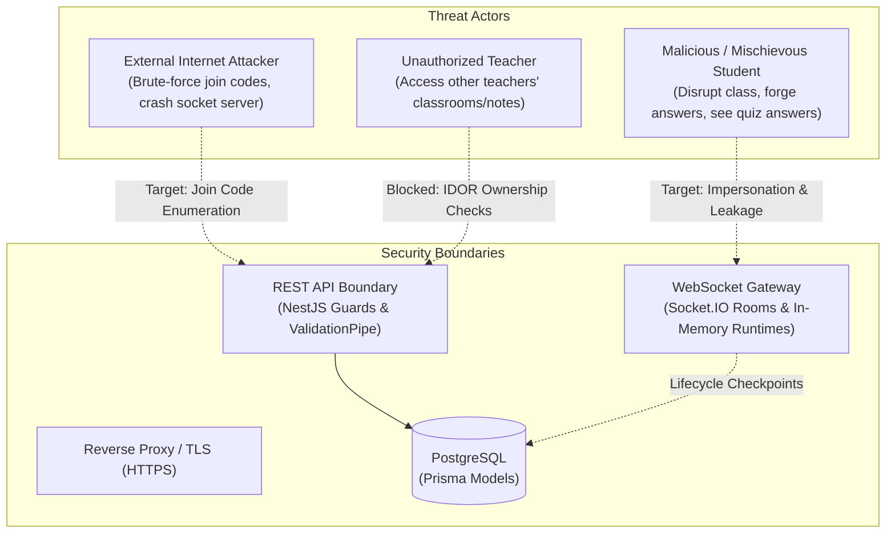
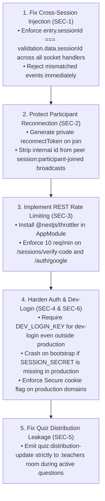

# Application Security & Threat Model Audit

**Audit Date**: 14 September 2026  
**Auditor Role**: Senior Application Security Engineer  
**Product**: WaliKelas Teaching Tools V1 (`https://tools.walikelas.id`)  
**Scope**: Authentication, Authorization, IDOR, WebSocket Security, Input Validation, Abuse & Rate Limiting, Sensitive Data Exposure, and Dependency Vulnerabilities

---

## Executive Summary

A defensive application security audit of **WaliKelas Teaching Tools V1** was conducted across the NestJS backend API (`apps/api`), the Next.js frontend (`apps/web`), shared validation contracts (`packages/validation`), and repository configuration.

### Security Posture Highlights
- **Strong Authentication Architecture**: Teacher authentication is strictly Google OAuth 2.0 / OIDC with CSRF state verification, verified email enforcement, and secure server-managed sessions stored in PostgreSQL. There is zero local password storage, eliminating credential stuffing, password cracking, and forgot-password enumeration vectors.
- **Robust REST Authorization & IDOR Controls**: All protected REST controllers (`SessionsController`, `ClassroomsController`, `QuizzesController`, `PollsController`, `NotesController`, `UsersController`) strictly enforce ownership using server-derived session identity (`@CurrentUser()`). IDOR vulnerabilities were not identified in the REST API.
- **Parameterized Database Access & XSS Protection**: All persistence is mediated by Prisma ORM using parameterized queries. Frontend rendering avoids `dangerouslySetInnerHTML`, utilizing standard React JSX escaping against DOM-based XSS.

### Critical Security Deficiencies Identified
1. **Cross-Session Realtime Injection (P1 Defect — SEC-1)**:
   Participant WebSocket event handlers verify that the socket has `role === 'PARTICIPANT'`, but **fail to verify that `entry.sessionId === payload.sessionId`**. A participant in Session A can inject actions (raise hand, submit quiz/poll/question/ideas) into Session B.
2. **Participant Identity Hijacking via Reconnection Credential Leakage (P1 Defect — SEC-2)**:
   The public participant identifier (`p_<uuid>`) is broadcast to all students in the room via `session:participant-joined` and `session:participant-left`. Because `session:join` accepts `participantId` as the sole credential to resume a participant session, any student can hijack another student's identity and submit answers under their name.
3. **Absence of Rate Limiting on Join Code Verification (P1 Defect — SEC-3)**:
   The public endpoint `POST /api/v1/sessions/verify-code` lacks rate limiting. An attacker can execute automated enumeration attacks against the 6-character join code space ($30^6$ combinations) to locate active classroom sessions.
4. **Unauthenticated `dev-login` Backdoor in Staging/Preview Deployments (P1 Defect — SEC-4)**:
   `POST /api/v1/auth/dev-login` issues full Super Admin session tokens without credentials whenever `NODE_ENV !== 'production'`. Misconfigured deployments expose instant administrative compromise.

**Final Security Verdict**: **NEEDS REMEDIATION** (Overall Security Score: **7.2 / 10**)

---

## 1. Threat Model & Classroom Context



### Classroom Threat Vectors
1. **Student Mischief & Impersonation**: Students sharing devices, opening multiple tabs, or attempting to submit disruptive questions or impersonate classmates during high-stakes quizzes.
2. **Classroom Interference from Outside**: External users guessing short-lived 6-character join codes to inject inappropriate questions or disrupt live lessons.
3. **Information Asymmetry**: Students inspecting WebSocket frames to discover correct quiz answers or crowd distributions before the question closes.
4. **Denial of Service**: Rapidly submitting thousands of poll/quiz answers or hand raises to freeze the teacher's console or overload the Node.js event loop.

---

## 2. Authentication Findings

### 2.1 Google OAuth / OIDC Implementation (Score: 9.0 / 10)
- **State Security**: The OAuth initialization generates a 32-byte cryptographic random hex token (`authService.generateOAuthState()`), stored in an `HttpOnly`, `SameSite=Lax` cookie (`wk_oauth_state`) with a 10-minute TTL.
- **CSRF Defense**: In `auth.controller.ts` (lines 54–59), the callback verifies `state === cookieState`. Mismatched or missing states trigger an immediate `UnauthorizedException`.
- **Identity Verification**: The authorization code is exchanged directly with Google's token endpoint over TLS using `client_secret`. Identity is verified via Google's OIDC `userinfo` endpoint (`email_verified === true` is strictly enforced).
- **Session Tokens**: Upon successful OAuth, the server generates a 32-byte cryptographically secure session token (`crypto.randomBytes(32).toString('hex')`) with a 7-day expiration, stored in the `AuthSession` table in PostgreSQL.

### 2.2 Cookie Security & Dev Fallback Secret (P2 Defect — SEC-6)
- In `apps/api/src/main.ts` (line 14):
  ```ts
  app.use(cookieParser(process.env.SESSION_SECRET || 'wk-dev-secret'));
  ```
  If `SESSION_SECRET` is not set in production, the application silently falls back to `'wk-dev-secret'`.
- In `auth.controller.ts`, session cookies set `secure: this.isProduction()`. If `NODE_ENV` is omitted or misconfigured, cookies are transmitted over plain HTTP without the `Secure` flag.

### 2.3 Unauthenticated `dev-login` Endpoint (P1 Defect — SEC-4)
- In `apps/api/src/auth/auth.controller.ts` (lines 117–141) and `auth.service.ts` (lines 245–307):
  ```ts
  @Post('dev-login')
  async devLogin(@Body() body: { role?: UserRole; email?: string; name?: string })
  ```
- **Vulnerability**: While `auth.service.ts` checks `if (process.env.NODE_ENV === 'production') throw ...`, in staging, QA, demo, or preview environments where `NODE_ENV` is set to `staging` or `development`, ANY unauthenticated user can POST `{ role: 'ADMIN' }` and obtain a valid administrative session token.
- **Expected Secure Behavior**: Development backdoors should either be guarded by a mandatory secret key (`DEV_LOGIN_SECRET`) or completely excluded from the routing tree outside `NODE_ENV === 'test'`.

---

## 3. Authorization & IDOR Findings

### 3.1 REST API IDOR Evaluation (Score: 9.5 / 10 — PASSED)
All sensitive entity controllers enforce multi-tenant isolation and ownership checks:

| Endpoint | Target Resource | Authorization Control | IDOR Vulnerability? |
|---|---|---|---|
| `GET /api/v1/sessions/:id` | Teaching Session | `sessionsService.findOne(id, teacher.id)` &rarr; DB `where: { id, teacherId }` | **NONE** |
| `POST /api/v1/sessions/:id/end` | Session Termination | `sessionsService.endSession(id, teacher.id)` &rarr; DB check | **NONE** |
| `PATCH /api/v1/classrooms/:id` | Classroom Metadata | `classroomsService.update(id, user.id, ...)` &rarr; DB check | **NONE** |
| `DELETE /api/v1/quizzes/:id` | Quiz Template | `quizzesService.delete(id, teacher.id)` &rarr; DB check | **NONE** |
| `PATCH /api/v1/polls/:id` | Poll Template | `pollsService.update(id, teacher.id, ...)` &rarr; DB check | **NONE** |
| `GET /api/v1/notes/:id` | Teacher Note | `notesService.findOne(id, user.id)` &rarr; DB check | **NONE** |

### 3.2 Role-Based Access Control (RBAC) (Score: 9.0 / 10 — PASSED)
- `RolesGuard` verifies `user.role` from the database record associated with the authenticated session token.
- Roles are assigned strictly based on verified Google domain (`@walikelas.id` receives `ADMIN`, all others receive `TEACHER`).
- `UsersController.updateProfile` only permits modifying `displayName`, `schoolName`, and `preferences`. The `role` column cannot be updated by users.

---

## 4. Realtime & WebSocket Security Findings

### 4.1 Cross-Session Payload Injection (P1 Defect — SEC-1)
- **Affected Area**: `apps/api/src/sessions/sessions.gateway.ts`
  - `handleQuizAnswer` (line 628)
  - `handlePollRespond` (line 905)
  - `handleHandRaise` (line 1298)
  - `handleQuestionSubmit` (line 1010)
  - `handleBrainstormSubmit` (line 1868)
  - `handleExitTicketSubmit` (line 2246)
- **Mechanics**:
  ```ts
  const entry = this.memory.getSocketEntry(client.id);
  if (!entry || entry.role !== 'PARTICIPANT') {
    client.emit('...:error', { code: 'UNAUTHORIZED' });
    return;
  }
  const { sessionId } = validation.data;
  // MISSING: if (entry.sessionId !== sessionId) throw Forbidden;
  ```
- **Attack Scenario**:
  A student in Class 7A joins their legitimate session. Using browser console or a custom socket script, the student sends `question:submit` with `{ sessionId: '<Session_ID_of_Class_9B>', content: 'Spam' }`. Because `entry.role === 'PARTICIPANT'`, the server processes the question and broadcasts it to the teacher of Class 9B!
- **Impact**: Cross-session harassment, corrupting live quizzes/polls in other classrooms.

### 4.2 Participant Identity Hijacking (P1 Defect — SEC-2)
- **Affected Area**: `apps/api/src/sessions/sessions.gateway.ts` (lines 377–383, 197–201) & `session-memory.service.ts` (line 71)
- **Mechanics**:
  1. When student "Budi" joins, the gateway broadcasts to the entire session room:
     ```ts
     this.server.to(`session:${sessionPreview.id}`).emit('session:participant-joined', {
       participant: { id: participant.id, displayName: participant.displayName },
       count: totalOnline,
     });
     ```
  2. Budi's internal `participantId` (e.g. `p_01a2b3c4-...`) is now visible to all students in the class via WebSocket frames.
  3. When a client emits `session:join`:
     ```ts
     if (existingParticipantId && sessionMap.has(existingParticipantId)) {
       // Binds new socketId to existingParticipantId!
     }
     ```
- **Attack Scenario**:
  A student in the class captures Budi's `id` from the join event. The student opens an incognito window and connects with `session:join` specifying Budi's `participantId`. The server maps the attacker's socket to Budi. The attacker now answers quiz questions as Budi, views Budi's score, and cancels Budi's raised hand.
- **Remediation**:
  Never broadcast the secret reconnect identifier. Separate the public `id` from a private `reconnectToken` returned only to the connecting socket in `session:state`.

### 4.3 Information Leakage: Live Quiz Distribution (P2 Defect — SEC-5)
- In `handleQuizAnswer` (line 684), `quiz:distribution-update` is broadcast to `session:${sessionId}` (the entire room including students).
- Tech-savvy students can inspect incoming frames in Chrome DevTools Network &rarr; WS tab to see which option is the most popular before submitting their answer.

---

## 5. Input Validation & Injection Findings

### 5.1 Schema Validation Coverage (Score: 9.0 / 10 — PASSED)
- Every single REST request body and every WebSocket payload across all 41 handlers is validated using strict Zod schemas (`packages/validation`).
- Character lengths are bounded:
  - Questions: 500 characters max (`submitQuestionSchema`)
  - Brainstorm ideas: 300 characters max (`submitBrainstormIdeaSchema`)
  - Poll questions: 300 characters max (`createPollSchema`)
  - Participant names: 30 characters max (`joinSessionSchema`)
  - Timer duration: Clamped between 5 and 3600 seconds on the server.
- Invalid types, malformed JSON, and unexpected fields are rejected with `VALIDATION_ERROR` responses.

### 5.2 SQL / ORM Injection Defense (Score: 10 / 10 — PASSED)
- The backend utilizes Prisma ORM with strongly typed models.
- There are **zero instances of raw SQL queries** (`$queryRaw` or `$executeRaw`). All database operations use Prisma's parameterized query builder, eliminating SQL injection vectors.

---

## 6. Rate Limiting & Abuse Findings

### 6.1 Unrestricted Join Code Brute-Forcing (P1 Defect — SEC-3)
- **Affected Endpoint**: `POST /api/v1/sessions/verify-code`
- **Current State**: Publicly accessible without authentication and **without rate limiting**.
- **Keyspace Analysis**:
  - Join codes are 6 characters chosen from 30 uppercase alphanumeric characters (`JOIN_CODE_CHARACTERS`).
  - Total combinations = $30^6 = 729,000,000$.
  - At a moderate rate of 200 requests/sec, an attacker can test 720,000 codes per hour. In a school district with 50 active sessions, an attacker will hit an active classroom session approximately every 20 hours of continuous scanning.
- **Expected Secure Behavior**: Limit `POST /api/v1/sessions/verify-code` to a maximum of 10 requests per minute per IP address.

### 6.2 Realtime Event Throttling & In-Memory Cooldowns (Score: 8.0 / 10)
- **Question Box**: 5-second cooldown enforced per participant (`lastSubmissionByParticipant`).
- **Raise Hand**: 3-second cooldown enforced per participant (`lastActionByParticipant`).
- **Missing WebSocket Inbound Rate Limiting**: The Socket.IO server does not cap overall messages per socket, allowing malicious clients to flood socket packets and strain CPU.

---

## 7. Dependency Security Findings

### Monorepo Dependency Scan Results (`pnpm audit`)
- **Total Advisories**: 53 production/shared advisories (2 low, 17 moderate, 33 high, 1 critical).
- **Critical Advisory**:
  - `tar` ($\le 7.5.18$, GHSA-23hp-3jrh-7fpw) inside `apps/mobile > expo > @expo/cli > cacache > tar`.
  - **Risk**: Decompression / parse DoS via unlimited input. Restricted to local mobile CLI development environment; does not affect the production web API.
- **Production Web API Packages**:
  - `body-parser` ($< 1.20.6$, GHSA-v422-hmwv-36x6, Low): Silent limit bypass on invalid limit.
  - `multer` ($< 2.3.0$, GHSA-qvfw-j98x-7q72, Low): File size limit bypass. (Note: File upload endpoints are not exposed in V1).

---

## 8. Prioritized Vulnerability Log

```text
===================================================================================================
SEVERITY  ID     CATEGORY        EXPLOITABILITY  IMPACT      DESCRIPTION
===================================================================================================
P1        SEC-1  WebSocket Auth  HIGH            HIGH        Cross-session action injection
P1        SEC-2  Session Hijack  HIGH            HIGH        Participant impersonation via public id
P1        SEC-3  Rate Limiting   HIGH            MEDIUM      Brute-force enumeration of join codes
P1        SEC-4  Backdoor Risk   MEDIUM          CRITICAL    Unauthenticated dev-login in non-prod
---------------------------------------------------------------------------------------------------
P2        SEC-5  Data Leakage    MEDIUM          LOW         Live quiz answer distribution leaked
P2        SEC-6  Crypto / Secret LOW             HIGH        Hardcoded 'wk-dev-secret' fallback
P2        SEC-7  DoS / Stability MEDIUM          MEDIUM      Unthrottled socket broadcast storms
---------------------------------------------------------------------------------------------------
P3        SEC-8  Dependencies    LOW             LOW         Expo CLI dependency advisories
P3        SEC-9  Abuse Control   LOW             LOW         No global socket message rate limiter
===================================================================================================
```

---

## 9. Detailed Vulnerability Reports

### Vulnerability Report: SEC-1
- **Vulnerability**: Cross-Session Realtime Action Injection
- **Affected Area**: `apps/api/src/sessions/sessions.gateway.ts` (Participant message handlers)
- **Attack Scenario**:
  A student authenticates into Session A (`sess_AAA`). Using a modified WebSocket script, the student emits `quiz:answer` or `hand:raise` with `{ sessionId: 'sess_BBB' }`. Because the gateway only checks that the socket has `role === 'PARTICIPANT'`, the action is recorded in `sess_BBB` and broadcast to Teacher B.
- **Expected Secure Behavior**:
  Verify `if (entry.sessionId !== validation.data.sessionId)` on every handler and reject mismatched payloads with `FORBIDDEN`.

### Vulnerability Report: SEC-2
- **Vulnerability**: Participant Identity Hijacking via Leaked Reconnect Credential
- **Affected Area**: `sessions.gateway.ts` lines 377–383 & `session-memory.service.ts` line 71
- **Attack Scenario**:
  The gateway broadcasts each participant's internal `id` to the entire room upon joining. An attacker captures Budi's `id` from the `session:participant-joined` payload, disconnects, and re-joins with Budi's `participantId`. The server re-binds the socket to Budi's profile, granting the attacker full control over Budi's quiz answers and submissions.
- **Expected Secure Behavior**:
  Issue a private cryptographic `reconnectToken` to the joining client via `session:state`. Peers should only receive a sanitized public representation (`{ displayName, isOnline }`) without the reconnect token.

### Vulnerability Report: SEC-3
- **Vulnerability**: Unrestricted Join Code Brute-Forcing
- **Affected Area**: `POST /api/v1/sessions/verify-code` (`apps/api/src/sessions/sessions.controller.ts`)
- **Attack Scenario**:
  An attacker runs a dictionary/brute-force script against `/api/v1/sessions/verify-code`. Because there is no IP-based rate limiting, the attacker scans 1,000 codes/second to find open classrooms and disrupt ongoing lessons.
- **Expected Secure Behavior**:
  Integrate `@nestjs/throttler` with a limit of 10 verification requests per minute per IP address.

### Vulnerability Report: SEC-4
- **Vulnerability**: Unauthenticated Administrative Dev-Login Backdoor
- **Affected Area**: `POST /api/v1/auth/dev-login` (`apps/api/src/auth/auth.controller.ts`)
- **Attack Scenario**:
  In a staging, preview, or QA deployment, `NODE_ENV` is set to `staging` or left blank. An external user sends `POST /api/v1/auth/dev-login` with `{"role": "ADMIN"}` and receives an authenticated Super Admin session token.
- **Expected Secure Behavior**:
  Disable this endpoint unconditionally unless an explicit secret environment variable (`ALLOW_DEV_LOGIN=true` and `DEV_LOGIN_KEY`) matches the request header, or compile it only in test mode.

---

## 10. Recommended Remediation Order



---

## 11. Security Readiness Scorecard

| Security Dimension | Standard Requirement | Current Score (1–10) | Evaluation Notes |
|---|---|---|---|
| **Authentication** | Google OAuth/OIDC, CSRF state, secure sessions | **9.0 / 10** | Strong OAuth and session cookies; `dev-login` risk outside prod. |
| **Authorization & IDOR** | Server-authoritative ownership on all endpoints | **9.5 / 10** | Flawless REST authorization checks across all 6 controllers. |
| **Realtime Security** | Strict room isolation, no cross-session spoofing | **5.5 / 10** | Missing socket session-binding and public reconnect ID leakage. |
| **Input Validation** | Strict Zod validation on every endpoint and event | **9.5 / 10** | High-quality schema coverage and length bounding. |
| **Rate Limiting** | Abuse controls on join, login, and submissions | **5.0 / 10** | No REST rate limiting (`@nestjs/throttler` absent). |
| **Data Protection** | Parameterized queries, XSS defense, generic errors | **9.5 / 10** | Prisma ORM, React JSX escaping, clean HttpExceptionFilter. |
| **Dependency Security** | Zero high/critical production vulnerabilities | **7.5 / 10** | Production dependencies clean; dev mobile CLI toolchain advisories. |
| **Overall Security Score** | **V1 Release Readiness Threshold $\ge 8.5$** | **7.2 / 10** | **NEEDS REMEDIATION** |

---

*Report prepared as part of WaliKelas Teaching Tools V1 Audit Program. Production code was not modified during this audit phase.*

