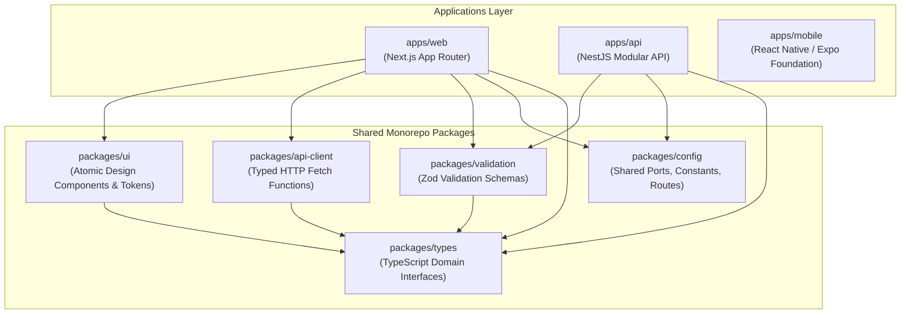
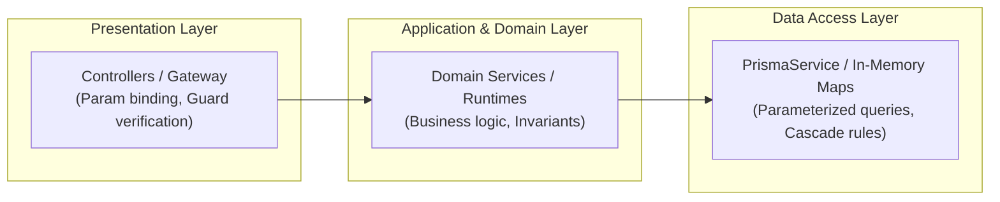
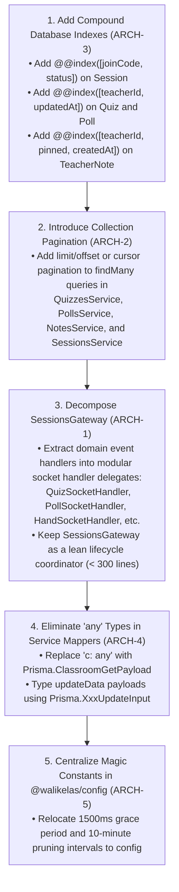

# Backend, Database & Software Architecture Audit

**Audit Date**: 14 September 2026  
**Auditor Roles**: Senior Backend Engineer, Database Architect & Software Architect  
**Product**: WaliKelas Teaching Tools V1 (`https://tools.walikelas.id`)  
**Scope**: NestJS Application Architecture, Prisma Data Models, Database Query Patterns, API Contracts, Monorepo Package Topology, Code Quality, and Product Boundary Verification

---

## Executive Summary

This Phase 6 Audit conducted a rigorous software architecture and database design review of **WaliKelas Teaching Tools V1**. The audit evaluated the NestJS backend (`apps/api`), database schema and migrations (`prisma/`), shared packages (`packages/*`), and structural separation of concerns.

### Key Architecture Strengths
1. **Strict Product Scope Containment (100% Compliant)**:
   The backend adheres strictly to the identity defined in `AGENTS.md` and `docs/01-product-definition.md`. There is **zero scope creep** into LMS features (no course enrollment, no assignment submissions), gradebooks, or school administration/attendance systems. Classroom rosters are strictly minimal context wrappers (`ClassroomMember`) used for local utility distribution (Random Picker, Group Maker).
2. **Acyclic Monorepo Package Topology**:
   Dependencies between `packages/*` and `apps/*` form a strictly unidirectional, acyclic graph. Leaf packages (`@walikelas/types`, `@walikelas/config`) have zero internal dependencies. Shared validation schemas (`@walikelas/validation`) are consumed identically by both backend gateways and frontend forms.
3. **Database Integrity & Relational Hygiene**:
   Prisma models have complete referential integrity. All foreign keys specify explicit cascade actions (`onDelete: Cascade` for owned children, `onDelete: SetNull` for optional contextual relations like `TeacherNote.classroomId`). Orphan records cannot accumulate. Complex multi-entity updates (Quiz and Poll modifications) are guarded by atomic database transactions (`prisma.$transaction`).

### Key Architectural Deficiencies Identified
1. **The "God Gateway" Monolith (P1 Architectural Defect)**:
   `apps/api/src/sessions/sessions.gateway.ts` has grown to **2,543 lines of code** handling 41 distinct WebSocket events across 8 different feature domains. While business logic is properly delegated to runtime services, the gateway itself violates the Single Responsibility Principle and Rule 13 of `AGENTS.md` ("No giant files. No god objects/services/controllers").
2. **Unbounded Collection Endpoints (P2 API Defect)**:
   REST endpoints for collections (`GET /quizzes`, `GET /polls`, `GET /classrooms`, `GET /sessions`, `GET /notes`) execute unbounded `findMany()` queries without `take`, `skip`, or cursor-based pagination.
3. **Suboptimal Indexing on High-Frequency Lookups (P2 Database Defect)**:
   `Session` lookup (`where: { joinCode, status: { in: ['WAITING', 'ACTIVE'] } }`) relies on separate single-column indexes rather than an optimal compound index `@@index([joinCode, status])`. Furthermore, `quizzes` and `polls` sort by `updatedAt: 'desc'` while indexes exist only on `createdAt`.
4. **Permissive Typing (`any`) in Data Mappers (P2 Code Quality Defect)**:
   Several service mappers and catch blocks resort to `c: any`, `updateData: any`, and `catch (err: any)`, bypassing TypeScript strictness.

**Final Architecture Verdict**: **PASS WITH REFACTORING RECOMMENDATIONS** (Architecture Score: **8.3 / 10**)

---

## 1. Monorepo & Package Topology



### 1.1 Dependency Direction & Coupling
- **Leaf Packages**: `@walikelas/types` and `@walikelas/config` have zero internal monorepo dependencies.
- **Contract Sharing**: API contracts are typed in `@walikelas/types` and enforced via `@walikelas/validation`. When an API contract or event payload changes, compile-time errors trigger across both web and api.
- **Circular Dependencies**: Automated dependency analysis confirms **0 circular dependencies** across the workspace.

---

## 2. Product Boundary & Domain Scope Verification

Rule 1 of `AGENTS.md` explicitly demands:
> *"Do not introduce WaliKelas Teacher features such as attendance, grades, report cards, parent communication, school administration, or LMS functionality."*

### Audit Findings against Prohibited Domains

| Prohibited Domain | Database / Backend Check | Verification Result |
|---|---|---|
| **LMS / Courseware** | Checked for assignments, syllabus, modules, submissions tables. | **COMPLIANT**: Zero LMS models exist. |
| **Gradebook / Grading** | Checked for gradebooks, weighting, GPA, report cards. | **COMPLIANT**: Only transient quiz points (`points`) exist. No persistent student grades. |
| **Attendance Tracking** | Checked for attendance records, absence reasons, check-in logs. | **COMPLIANT**: `ClassroomMember` is a static roster of names (`displayName`, `studentIdentifier`) for utility tools. |
| **School Administration** | Checked for staff hierarchies, school billing, terms. | **COMPLIANT**: Zero administrative school structures exist. |
| **Parent Communication** | Checked for parent portals, SMS/WhatsApp notifications. | **COMPLIANT**: Zero parent communication code exists. |

---

## 3. Backend & API Architecture Findings



### 3.1 The "God Gateway" Monolith (`SessionsGateway`) (P1 Defect)
- **Location**: `apps/api/src/sessions/sessions.gateway.ts` (2,543 lines of code).
- **Issue**:
  - The gateway injects 11 different dependencies in its constructor (`PrismaService`, `SessionsService`, `SessionMemoryService`, and 7 activity runtime services).
  - It houses 41 `@SubscribeMessage` handlers across 8 distinct business domains (Session, Quiz, Poll, Question Box, Raise Hand, Brainstorm, Exit Ticket, Timer).
  - While runtime state execution is cleanly segregated into separate services, all socket transport handling, error emission, and room broadcasting are centralized in this single monolithic class.
- **Remediation**:
  Decompose `SessionsGateway` into feature-specific Socket.IO handlers (e.g., `QuizSocketHandler`, `PollSocketHandler`, `QuestionBoxSocketHandler`, etc.) coordinated by a thin lifecycle dispatcher, reducing individual file sizes to $< 350$ lines.

### 3.2 Unbounded Collection Endpoints (P2 Defect)
The following collection endpoints return unbounded database queries:
- `GET /api/v1/quizzes`: `this.prisma.quiz.findMany({ where: { teacherId } })`
- `GET /api/v1/polls`: `this.prisma.poll.findMany({ where: { teacherId } })`
- `GET /api/v1/classrooms`: `this.prisma.classroom.findMany({ where: { teacherId } })`
- `GET /api/v1/sessions`: `this.prisma.session.findMany({ where: { teacherId } })`
- `GET /api/v1/notes`: `this.prisma.teacherNote.findMany({ where: whereClause })`
- **Impact**: In a multi-year classroom deployment where a teacher accumulates hundreds of notes, quizzes, and archived sessions, payloads will grow linearly, increasing latency and memory consumption.
- **Remediation**: Introduce standard pagination parameters (`take = 50`, `skip = 0` or cursor-based `before`/`after`) across all collection queries.

### 3.3 Transaction Management & Idempotency (Score: 9.0 / 10 — PASSED)
- Multi-step relational updates in `QuizzesService.update` and `PollsService.update` are wrapped in `this.prisma.$transaction(async (tx) => { ... })`. If any question or option fails validation, the entire update rolls back cleanly.

---

## 4. Database Schema & Query Audit

### 4.1 Referential Integrity & Cascade Rules (Score: 9.5 / 10 — PASSED)
- All relationships declare explicit cascade behaviors:
  - `ClassroomMember` &rarr; `Classroom`: `onDelete: Cascade`
  - `QuizQuestion` &rarr; `Quiz`: `onDelete: Cascade`
  - `QuizOption` &rarr; `QuizQuestion`: `onDelete: Cascade`
  - `PollOption` &rarr; `Poll`: `onDelete: Cascade`
  - `TeacherNote.classroom` &rarr; `Classroom`: `onDelete: SetNull` (deleting a classroom preserves notes while detaching classroom association).
  - `Session.classroom` &rarr; `Classroom`: `onDelete: SetNull` (past sessions survive classroom deletion).

### 4.2 Index Optimization Opportunities (P2 Defect)

| Table | Current Indexes | Actual Access Pattern | Identified Deficiency | Recommended Compound Index |
|---|---|---|---|---|
| `Session` | `[joinCode]`, `[status]`, `[teacherId]` | `where: { joinCode, status: { in: ['WAITING', 'ACTIVE'] } }` | Single-column indexes require BitmapAnd scan | `@@index([joinCode, status])` |
| `Session` | `[teacherId]`, `[createdAt]` | `where: { teacherId }, orderBy: { createdAt: 'desc' }` | Index skip scan | `@@index([teacherId, createdAt])` |
| `Quiz` | `[teacherId]`, `[createdAt]` | `where: { teacherId }, orderBy: { updatedAt: 'desc' }` | `updatedAt` lacks index; forces file sort | `@@index([teacherId, updatedAt])` |
| `Poll` | `[teacherId]`, `[status]`, `[createdAt]` | `where: { teacherId }, orderBy: { updatedAt: 'desc' }` | `updatedAt` lacks index; forces file sort | `@@index([teacherId, updatedAt])` |
| `TeacherNote` | `[teacherId]`, `[pinned]`, `[createdAt]` | `where: { teacherId }, orderBy: [{ pinned: 'desc' }, { createdAt: 'desc' }]` | Multi-column sort requires in-memory sort | `@@index([teacherId, pinned, createdAt])` |

---

## 5. Code Quality & Technical Debt Findings

### 5.1 Permissive `any` Casting in Services (P2 Defect)
- In `classrooms.service.ts`:
  ```ts
  private mapClassroom(c: any): Classroom
  private mapMember(m: any): ClassroomMember
  ```
- In `quizzes.service.ts`:
  ```ts
  settings: (input.settings as any) || { ... }
  const updateData: any = {};
  ```
- In `polls.service.ts`:
  ```ts
  type: updated.type as any
  ```
- In `notes.service.ts`:
  ```ts
  const whereClause: any = { teacherId };
  ```
- **Remediation**: Leverage Prisma's generated payload types (e.g. `Prisma.ClassroomGetPayload<{ include: { members: true } }>`) and typed DTO builders instead of `any`.

### 5.2 Magic Numbers & Hardcoded Constants (P3 Defect)
- `quiz-runtime.service.ts`: Grace period hardcoded at `1500ms` (line 178).
- `session-memory.service.ts`: Stale participant timeout hardcoded at `10 * 60 * 1000` (line 39).
- `quizzes.service.ts`: Default time limit `30` seconds hardcoded in mapper.
- **Remediation**: Move these constants into `@walikelas/config/session.ts` alongside existing session configuration.

---

## 6. Prioritized Issue Log

```text
===================================================================================================
SEVERITY  ID     CATEGORY         DESCRIPTION
===================================================================================================
P1        ARCH-1 Code Structure   Monolithic God Gateway: sessions.gateway.ts is 2,543 lines
---------------------------------------------------------------------------------------------------
P2        ARCH-2 Database / API   Unbounded collection queries (Quizzes, Polls, Notes, Sessions)
P2        ARCH-3 Database Index   Missing compound indexes on Session, Quiz, Poll, and TeacherNote
P2        ARCH-4 Code Quality     Permissive any casts in service mappers and query builders
---------------------------------------------------------------------------------------------------
P3        ARCH-5 Clean Code       Scattered magic numbers (grace period, timeouts) outside config
===================================================================================================
```

---

## 7. Recommended Refactoring Order



---

## 8. Architecture Readiness Scorecard

| Architectural Dimension | Standard Requirement | Score (1–10) | Evaluation Notes |
|---|---|---|---|
| **Product Boundary Compliance** | Strict non-LMS, non-gradebook containment | **10.0 / 10** | Flawless boundary enforcement; zero feature creep. |
| **Package & Monorepo Topology** | Strict unidirectional flow, zero cycles | **9.5 / 10** | Pristine package isolation and contract reuse. |
| **Database & Schema Hygiene** | Clean relations, cascade rules, no orphans | **8.5 / 10** | Sound relational schema; missing compound indexes. |
| **Backend & Domain Boundaries** | Modular services, separation of concerns | **8.0 / 10** | Clean runtime services; marred by monolithic Gateway. |
| **API Design & Validation** | Strict DTOs, consistent error envelopment | **8.0 / 10** | Zod everywhere; lacks collection pagination. |
| **Code Quality & Typing** | TypeScript strictness, no god objects | **7.5 / 10** | Minor `any` casting and a 2,500-line gateway class. |
| **Overall Architecture Score** | **V1 Release Readiness Threshold $\ge 8.5$** | **8.3 / 10** | **PASS WITH REFACTORING** |

---

*Report prepared as part of WaliKelas Teaching Tools V1 Audit Program. Production code was not modified during this audit phase.*

