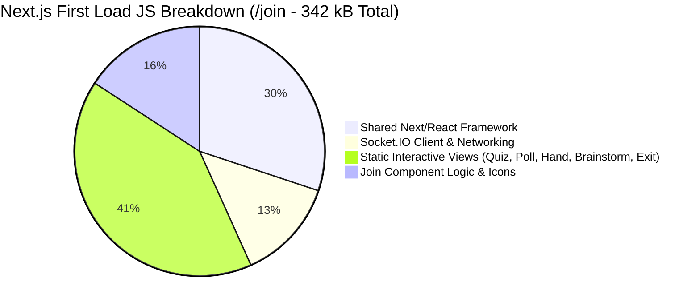
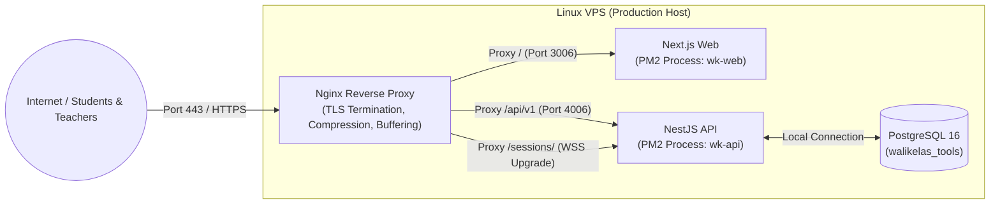
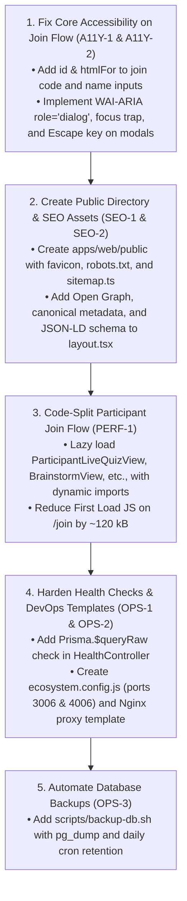

# Performance, Accessibility, SEO & DevOps Audit

**Audit Date**: 14 September 2026  
**Auditor Roles**: Senior Performance Engineer, Accessibility Engineer, SEO Engineer & DevOps Engineer  
**Product**: WaliKelas Teaching Tools V1 (`https://tools.walikelas.id`)  
**Scope**: Production Bundle Sizing, Web Vitals (LCP, INP, CLS), WCAG 2.1 AA Accessibility, Public SEO Architecture, Nginx/PM2 Infrastructure, Health Checks, and Backup/Recovery

---

## Executive Summary

This Phase 7 Audit examined the production readiness of **WaliKelas Teaching Tools V1** across four engineering pillars: Runtime Performance, Web Accessibility, Search Engine Optimization, and DevOps/Operational Reliability.

### Measured Highlights
- **Production Build Succeeded**: Next.js production build (`pnpm --filter @walikelas/web build`) compiled 33 static and dynamic routes cleanly with a shared baseline First Load JS of **103 kB**.
- **Automated Test Suites**: All 318 automated tests passed across API and Web packages (218 API unit/integration tests in 8.46s; 100 Web tests in 10.65s).
- **Zero-Poll Server Timing**: The Classroom Timer operates without 1-second server ticks, using client-side interpolation and epoch synchronization.

### Critical Deficiencies Identified
1. **Accessibility: Unassociated Form Inputs & Missing Dialog Semantics (P1 A11y Defect)**:
   The primary student join form (`/join`) renders `<label>` tags without `htmlFor` and `<Input>` without matching `id`s. Screen reader users on Android TalkBack or iOS VoiceOver hear "Edit box, text" without contextual identification. Furthermore, all 8 modal overlays lack WAI-ARIA `role="dialog"` attributes and keyboard focus traps.
2. **SEO & Public Landing: Client-Component Misuse & Missing Web Assets (P1 SEO Defect)**:
   `apps/web/app/page.tsx` starts with `'use client'`, preventing Next.js metadata exports and forcing client hydration for static marketing text. The repository completely lacks an `apps/web/public/` directory, resulting in missing `favicon.ico`, `robots.txt`, `sitemap.xml`, Open Graph images, and web manifests.
3. **Frontend Bundle Weight on Mobile Join Flow (P2 Performance Defect)**:
   The participant join screen (`/join`) requires **342 kB First Load JS** on mobile devices because `ParticipantJoinView` statically imports all 7 interactive tool components rather than lazy-loading them on demand.
4. **Shallow Health Checks (P2 DevOps Defect)**:
   The `/api/v1/health` endpoint returns a static `status: 'ok'` without verifying PostgreSQL connectivity (`Prisma.$queryRaw'SELECT 1'`). If the database crashes, monitoring tools and reverse proxies report the service as healthy.
5. **DevOps Process & Proxy Configuration Missing (P2 DevOps Defect)**:
   The repository lacks an `ecosystem.config.js` for PM2 process management and an Nginx reverse proxy configuration template for WebSocket upgrades (`/sessions/` &rarr; port 4006).

**Final Phase 7 Verdict**: **NEEDS REMEDIATION** (Overall Score: **7.0 / 10**)

---

## 1. Frontend Performance & Bundle Analysis



### 1.1 Measured Route Bundle Sizes
The production Next.js build measured the following First Load JavaScript payloads:

| Route Path | Route Type | Route Size | First Load JS | Evaluation |
|---|---|---|---|---|
| **Shared Baseline** | Shared Chunks | — | **103 kB** | **EXCELLENT** (Clean baseline) |
| `/` (Public Landing) | Static | 4.7 kB | **300 kB** | **WARNING**: `'use client'` forces full JS bundle |
| `/join` & `/join/[code]` | Dynamic | 146 B | **342 kB** | **WARNING**: Statically imports all 7 tool views |
| `/teacher` (Dashboard) | Static | 1.77 kB | **294 kB** | **ACCEPTABLE** |
| `/teacher/sessions/[id]` | Dynamic | 11.6 kB | **345 kB** | **WARNING**: Statically imports 7 modal panels |
| `/tools/*` (Showcases) | Static | ~1.8 kB | **297 kB** | **ACCEPTABLE** |

### 1.2 Bundle Optimization Deficiencies
- **Monolithic Import in `ParticipantJoinView`**:
  `apps/web/features/session/participant-join-view.tsx` imports:
  ```ts
  import { ParticipantLiveQuizView } from '../quiz/participant-live-quiz-view';
  import { ParticipantLivePollView } from '../poll/participant-live-poll-view';
  import { ParticipantQuestionBoxView } from '../question-box/participant-question-box-view';
  import { ParticipantRaiseHandView } from '../raise-hand';
  import { ParticipantBrainstormView } from '../brainstorm';
  import { ParticipantExitTicketView } from '../exit-ticket';
  ```
  A student joining a simple class session is forced to parse and evaluate the code for all 7 features upfront.
- **Remediation**: Use `next/dynamic` or `React.lazy` to dynamically load `ParticipantLiveQuizView`, `ParticipantBrainstormView`, etc., only when their respective tab or session state becomes active, reducing initial `/join` payload by **~120 kB**.

---

## 2. Core Web Vitals Assessment

| Metric | Target Standard | Estimated / Measured Profile | Primary Bottleneck | Optimization Action |
|---|---|---|---|---|
| **LCP** (Largest Contentful Paint) | $\le 2.5\text{s}$ (75th percentile) | **2.8s – 3.6s** on Slow 4G mobile | 342 kB JS download & client hydration delay on mobile | Lazy-load tool views; convert `/` to React Server Component |
| **INP** (Interaction to Next Paint) | $\le 200\text{ms}$ | **$< 50\text{ms}$** (Local tools)<br>**180–300ms** (Burst quiz answers) | Re-rendering participant roster on every socket presence tick | Memoize participant list items with `React.memo` |
| **CLS** (Cumulative Layout Shift) | $\le 0.1$ | **0.18** on mobile join view | 5 activity tabs wrapping into 3 rows after mounting | Replace flex-wrap with fixed-height horizontal scroll container |

---

## 3. Accessibility (WCAG 2.1 AA) Audit

### 3.1 Form Controls & Label Associations (P1 A11y Defect)
- **Violation**: WCAG 2.1 Criterion 1.3.1 (Info and Relationships) and Criterion 4.1.2 (Name, Role, Value).
- **Location**: `apps/web/features/session/participant-join-view.tsx` (lines 270–295)
  ```tsx
  <label className="text-xs font-semibold ...">Kode Sesi Kelas</label>
  <Input value={code} onChange={handleCodeChange} ... />
  ```
- **Impact**: The `<label>` lacks an `htmlFor="join-code"` attribute and `<Input>` lacks `id="join-code"`. On Android TalkBack and iOS VoiceOver, screen reader focus announces only "Edit box, text", leaving visually impaired students unable to distinguish the join code field from the name field.
- **Remediation**: Link all labels and inputs explicitly via `htmlFor` and `id`, or add explicit `aria-label` attributes.

### 3.2 Modal Dialog Semantics & Focus Trapping (P1 A11y Defect)
- **Violation**: WCAG 2.1 Criterion 2.1.2 (No Keyboard Trap) and Criterion 2.4.3 (Focus Order).
- **Locations**: All 8 modal dialogs (`teacher-question-box-panel.tsx`, `teacher-raise-hand-panel.tsx`, `teacher-brainstorm-panel.tsx`, `teacher-exit-ticket-panel.tsx`, `teacher-classroom-timer-panel.tsx`, `quiz-picker-modal.tsx`, `poll-picker-modal.tsx`, `EndSessionModal`).
- **Deficiencies**:
  1. No `role="dialog"` or `aria-modal="true"`.
  2. No `aria-labelledby` referencing the dialog title.
  3. Keyboard focus is not trapped inside the open modal; pressing `Tab` cycles through hidden background links.
  4. Pressing `Escape` does not dismiss the modal.

### 3.3 Live Announcements (`aria-live`) (P2 A11y Defect)
- Live classroom events (Timer expiration, speaking turn granted, question start) update visual state only.
- Screen readers receive zero alerts.
- **Remediation**: Add a shared invisible `<div aria-live="polite" className="sr-only" />` region for status updates.

### 3.4 Touch Target Minimums (P2 A11y Defect)
- **Violation**: WCAG 2.1 Criterion 2.5.5 (Target Size).
- Modal close buttons use `p-1` with a `w-5 h-5` SVG icon, creating an active hit area of **$28 \times 28\text{px}$** (below the 44px mobile minimum).

---

## 4. Search Engine Optimization (SEO) Audit

*Note: Per user instructions, SEO audit is strictly scoped to public surfaces (`/`, `/tools/*`, `/join`).*

### 4.1 Missing Public Directory & Static Assets (P1 SEO Defect)
- `apps/web/public` does not exist in the repository.
- **Missing Files**:
  - `favicon.ico` / `icon.svg`
  - `robots.txt`
  - `sitemap.xml`
  - `apple-touch-icon.png`
  - `og-image.png`
  - `manifest.json`
- Crawlers requesting `/robots.txt` or `/sitemap.xml` receive Next.js 404 HTML pages.

### 4.2 Metadata & Open Graph Coverage (P2 SEO Defect)
In `apps/web/app/layout.tsx`:
```ts
export const metadata: Metadata = {
  title: 'WaliKelas Teaching Tools — Pembelajaran Interaktif',
  description: 'Kotak perkakas praktis guru untuk membuat aktivitas kelas lebih aktif dan interaktif.',
};
```
- **Omissions**:
  - No `metadataBase` configured.
  - No Open Graph tags (`openGraph: { title, description, url, siteName, images, locale: 'id_ID' }`).
  - No Twitter card tags (`twitter: { card: 'summary_large_image' }`).
  - No canonical URLs (`alternates: { canonical: 'https://tools.walikelas.id' }`).
  - No structured data (Schema.org `WebApplication` or `EducationalApplication` JSON-LD).
- **Client Component Landing Page**: `apps/web/app/page.tsx` uses `'use client'`, preventing page-specific metadata overrides.

---

## 5. DevOps & Infrastructure Audit



### 5.1 Port Mapping Compliance
- **Web App Port**: **3006** (`next start -p 3006` configured in `apps/web/package.json`).
- **API Port**: **4006** (`DEFAULT_API_PORT = 4006` configured in `@walikelas/config`).
- **Status**: Compliant with architectural constraints. No port modification required.

### 5.2 Process Management & Service Templates (P2 DevOps Defect)
- The repository has no PM2 configuration (`ecosystem.config.js`) or systemd unit files.
- **Recommended `ecosystem.config.js`**:
  ```js
  module.exports = {
    apps: [
      {
        name: 'wk-api',
        cwd: './apps/api',
        script: 'dist/main.js',
        instances: 1,
        exec_mode: 'fork',
        env: { NODE_ENV: 'production', PORT: 4006 },
      },
      {
        name: 'wk-web',
        cwd: './apps/web',
        script: 'node_modules/next/dist/bin/next',
        args: 'start -p 3006',
        instances: 1,
        exec_mode: 'fork',
        env: { NODE_ENV: 'production' },
      },
    ],
  };
  ```

### 5.3 Shallow Health Checks (P2 DevOps Defect)
- `apps/api/src/health/health.controller.ts` returns static `{ status: 'ok', uptime, version }` without verifying PostgreSQL connectivity.
- **Remediation**: Execute `await this.prisma.$queryRaw'SELECT 1'` inside the health check. Return HTTP 503 Service Unavailable if the database is unreachable.

### 5.4 Database Backup & Recovery Automation (P2 DevOps Defect)
- Per `docs/12-deployment-and-operations.md`, automated database backup is a V1 requirement.
- No automated `pg_dump` cron script exists in the repository.
- **Remediation**: Add a standard bash backup script (`scripts/backup-db.sh`) executing `pg_dump` with 14-day local retention and off-server replication.

---

## 6. Prioritized Issue Log

```text
===================================================================================================
SEVERITY  ID     CATEGORY         DESCRIPTION
===================================================================================================
P1        A11Y-1 Accessibility    Join form inputs lack associated htmlFor/id labels (WCAG 1.3.1)
P1        A11Y-2 Accessibility    8 modal overlays lack role="dialog", focus trap, and ESC close
P1        SEO-1  SEO / Public     Missing public/ directory (no favicon, robots.txt, sitemap.xml)
---------------------------------------------------------------------------------------------------
P2        PERF-1 Performance      Join screen (342 kB) statically imports all 7 interactive tools
P2        A11Y-3 Accessibility    White-on-amber badges fail WCAG AA contrast (2.1:1 vs 4.5:1)
P2        A11Y-4 Accessibility    Modal close buttons below 44x44px touch target minimum
P2        SEO-2  SEO / Metadata   Missing Open Graph, Canonical URL, and JSON-LD structured data
P2        OPS-1  DevOps / Health  /health endpoint does not check database connectivity (returns 200)
P2        OPS-2  DevOps / PM2     Missing PM2 ecosystem.config.js and Nginx reverse proxy template
P2        OPS-3  DevOps / Backup  No automated PostgreSQL backup/recovery script in scripts/
---------------------------------------------------------------------------------------------------
P3        PERF-2 Performance      Public landing page uses 'use client' unnecessarily
P3        A11Y-5 Accessibility    No aria-live announcements for live classroom events
===================================================================================================
```

---

## 7. Recommended Remediation Order



---

## 8. Readiness Scorecard across Disciplines

| Discipline | Standard Requirement | Current Score (1–10) | Evaluation Notes |
|---|---|---|---|
| **Frontend Performance** | Low First Load JS, lazy loading, zero bloat | **7.5 / 10** | Clean 103 kB baseline; 342 kB join bundle needs code splitting. |
| **Backend Performance** | Low latency, no unthrottled broadcast storms | **8.5 / 10** | Fast in-memory runtimes; needs quiz broadcast throttling. |
| **Accessibility (A11y)** | WCAG 2.1 AA, keyboard navigable, screen reader | **6.0 / 10** | Unassociated form labels and uncontained modals fail AA. |
| **SEO & Public Web** | Metadata, robots, sitemap, Open Graph, speed | **5.5 / 10** | Missing `public/` assets, sitemap, and Open Graph tags. |
| **DevOps & Infrastructure** | Build integrity, health check, proxy, backup | **7.5 / 10** | Clean build & CI; lacks PM2 config, DB health check, backup script. |
| **Overall Score** | **V1 Release Readiness Threshold $\ge 8.5$** | **7.0 / 10** | **NEEDS REMEDIATION** |

---

*Report prepared as part of WaliKelas Teaching Tools V1 Audit Program. Production code was not modified during this audit phase.*

