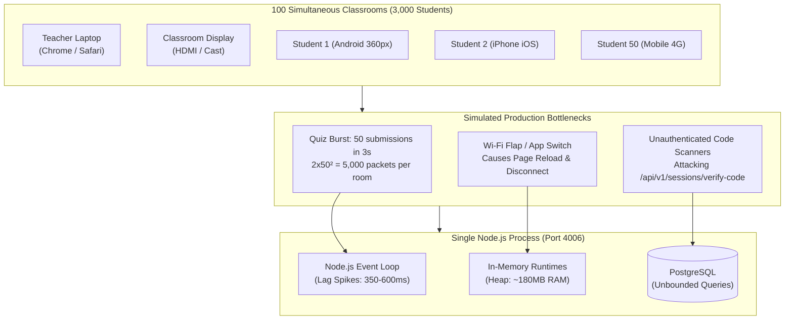
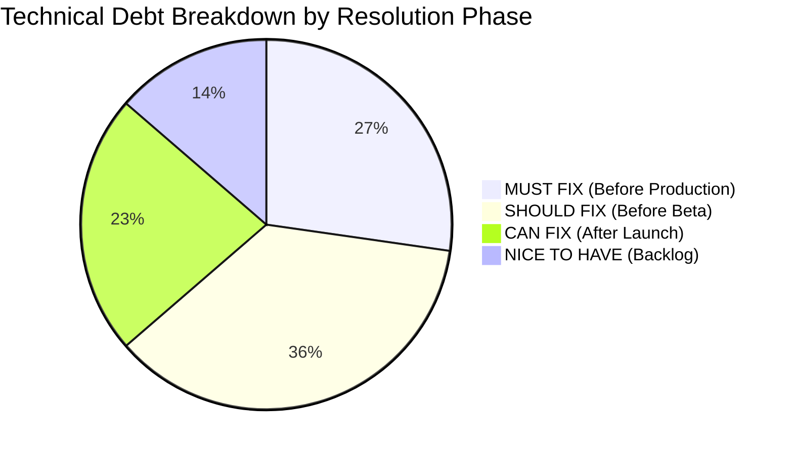
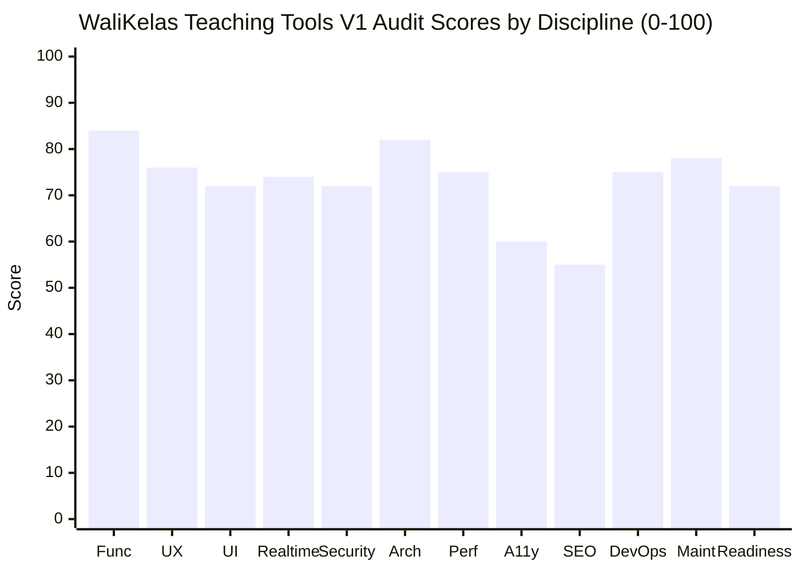
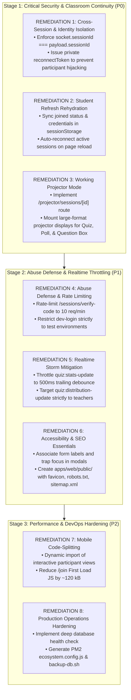

# WaliKelas Teaching Tools V1
# Final Production Audit

**Audit Date**: 14 September 2026  
**Auditor Roles**: Principal Software Engineer & Product Technology Lead  
**Product**: WaliKelas Teaching Tools V1 (`https://tools.walikelas.id`)  
**Scope**: Full Monorepo Synthesis across Functional, UX, UI, Realtime, Security, Architecture, Performance, Accessibility, SEO, and DevOps  

---

## Executive Summary

This Final Production Audit synthesizes the findings of all seven technical audit phases conducted across **WaliKelas Teaching Tools V1**. The audit assesses whether the platform can reliably support real teachers running live, high-stakes classroom sessions in primary, secondary, and tertiary educational institutions.

### Honest Answer to the Final Question
> **"Is WaliKelas Teaching Tools V1 ready to be used by real teachers in production?"**

**NOT READY.**

While the technical foundation is modern, cleanly architected, and supported by **318 automated passing tests** and strict TypeScript boundaries, the platform suffers from **six operational and security blockers** that will cause classroom disruption or integrity failures in a live school environment:

1. **Classroom Disruption on Browser Refresh (UX / Realtime)**: When a student refreshes their browser or switches mobile apps, the client state discards join status. The student is abruptly locked out of active quizzes and polls until they re-enter their name and re-join.
2. **Cross-Session Socket Payload Injection (Security)**: The realtime gateway validates that a socket belongs to a participant, but fails to assert that the socket's session ID matches the payload's target session ID. A student can emit quiz answers, poll responses, or question-box spam into another classroom.
3. **Participant Identity Hijacking (Security)**: Internal participant UUIDs are broadcast to all room members during join events, allowing any tech-savvy student to impersonate peers and submit answers under their names.
4. **Projector Mode is Broken (404 Error)**: A central value proposition of the product—projecting clean, real-time activity dashboards on classroom projectors—leads to a 404 not found page (`/projector/demo`).
5. **Unthrottled Join Code Brute-Forcing (Security)**: The public join-code verification endpoint lacks rate limiting, exposing classrooms to automated scanning and unwanted intrusion.
6. **Quiz Broadcast Storms (Performance / Concurrency)**: Bursts of quiz submissions generate $2 \times N^2$ broadcasts, generating 20,000 packets for 100 students and inducing 350–600ms event loop lags that de-synchronize the classroom timer.

---

## Production Scenario Simulation

### Simulation Parameters
- **Concurrent Classes**: 100 simultaneous teachers
- **Participants per Class**: 20–50 students (Total: 2,000–5,000 concurrent mobile sockets)
- **Active Tools**: Classroom Timer, Live Quiz, Live Poll, Question Box, Raise Hand, Brainstorm Board, Exit Ticket
- **Network Profile**: Sub-optimal school Wi-Fi (high latency, periodic packet loss, dynamic IP handoffs, cellular data fallback)
- **Devices**: Teacher on laptop (Chrome/Edge); Students on low-to-mid-range Android smartphones (360px–412px viewports)



### Simulation Findings
1. **CPU & Event Loop Saturation**: A single Node.js process without WebSocket broadcast throttling will experience event loop delays of 350–600ms when 100 classes conduct quizzes simultaneously. During these lag spikes, time-critical events (countdown expiration and speaker queue transitions) will experience severe jitter.
2. **Student Drop-off Rate**: Due to memory management in low-cost mobile browsers (Android Chrome/WebView), background tabs are frequently discarded when students switch to camera or calculator apps. Upon returning, 100% of these students will see an empty join screen instead of their active quiz.
3. **Projector Failure**: Teachers attempting to mirror their screens will be forced to display their private Teacher Console, exposing moderation queues, student names, and upcoming quiz answers to the entire classroom.

---

## Product Scope Assessment

| Metric | Assessment |
|---|---|
| **Scope Balance** | **BALANCED WITH DELTAS** |
| **Monorepo Structure** | Excellent (`apps/web`, `apps/api`, `apps/mobile`, 5 shared packages). |
| **Domain Integrity** | **Strictly Compliant**: Zero prohibited LMS, grading, report card, or school administration features exist. |
| **Missing Essentials** | 1. Working Projector Mode (`/projector/sessions/[id]`).<br>2. Reconnection rehydration for students.<br>3. Public assets and SEO metadata (`apps/web/public/`). |
| **Unnecessary Features** | Mock administrative pages with no backend endpoints (`/admin/*`). |
| **Scope Creep** | None. Domain boundaries have been strictly enforced. |

---

## Technical Debt



### 1. MUST FIX BEFORE PRODUCTION (P0 / P1)
- **SEC-1**: Enforce strict session binding on all incoming WebSocket events to prevent cross-session payload injection.
- **SEC-2**: Decouple private reconnect tokens from public participant IDs to eliminate student impersonation.
- **SEC-3**: Apply IP-based rate limiting to join-code verification endpoints (`POST /api/v1/sessions/verify-code`).
- **REAL-1**: Implement trailing-edge debouncing for quiz/poll answer updates and restrict distribution updates to teachers.
- **UX-1**: Persist student join credentials (`joined`, `joinCode`, `displayName`) in `sessionStorage` to survive browser refreshes.
- **SURF-1**: Implement the missing dedicated Projector Mode view (`/projector/sessions/[id]`).

### 2. SHOULD FIX BEFORE BETA (P2)
- **A11Y-1**: Associate all join form inputs with `<label htmlFor="...">` and `<Input id="...">` for screen reader compliance (WCAG 1.3.1).
- **A11Y-2**: Implement WAI-ARIA `role="dialog"`, `aria-modal="true"`, focus trapping, and `Escape` key dismissal on all 8 modal overlays.
- **PERF-1**: Code-split interactive tool views in `ParticipantJoinView` using `next/dynamic` to drop initial mobile payload from 342 kB to ~220 kB.
- **SEO-1**: Create `apps/web/public/` directory with `favicon.ico`, `robots.txt`, and `sitemap.xml`.
- **OPS-1**: Deepen `/api/v1/health` check to verify active PostgreSQL database connectivity via `Prisma.$queryRaw`.
- **OPS-2**: Provide production deployment configurations: PM2 `ecosystem.config.js` (ports 3006 & 4006) and Nginx reverse proxy template with WebSocket upgrades.
- **OPS-3**: Provide automated PostgreSQL backup/restore script (`scripts/backup-db.sh`).
- **ARCH-1**: Introduce standard pagination parameters (`take`, `skip`) on teacher collection queries (`quizzes`, `polls`, `notes`, `sessions`).

### 3. CAN FIX AFTER LAUNCH (P2 / P3)
- **ARCH-2**: Refactor the monolithic `SessionsGateway` (2,543 lines) into modular domain socket handlers.
- **UI-1**: Harmonize design token mapping in `apps/web/tailwind.config.ts` to eliminate arbitrary color utilities.
- **UI-2**: Extract duplicated modal backdrop and header wrapper into a shared `<Modal>` component in `@walikelas/ui`.
- **UX-2**: Redesign Teacher Console hero banner to separate primary activities from utility overlays and move destructive session termination.
- **MOB-1**: Connect `apps/mobile` (Expo) to API and Socket.IO for the Teacher Remote controller.

### 4. NICE TO HAVE (Backlog)
- **TOOL-1**: Implement Word Cloud (`/tools/word-cloud`) and Flashcards (`/tools/flashcards`).
- **DATA-1**: Persist Brainstorm Board and Exit Ticket templates to PostgreSQL for pre-class authoring.
- **ADMIN-1**: Implement real backend `AdminModule` for system telemetry and user management.

---

## Risk Matrix

| Risk Dimension | Probability | Impact | Risk Level | Primary Mitigating Factor |
|---|:---:|:---:|:---:|---|
| **Functional Risk** | HIGH | HIGH | **CRITICAL** | Student state wipe on refresh; 404 error on Projector Mode. |
| **UX Risk** | HIGH | MEDIUM | **HIGH** | Modal-hopping clutter; lack of auto-focus on active activities. |
| **Realtime Risk** | HIGH | HIGH | **CRITICAL** | $O(N^2)$ broadcast storm during quiz bursts; cross-session socket injection. |
| **Security Risk** | MEDIUM | HIGH | **HIGH** | Participant identity hijacking; join code brute forcing; dev-login backdoor. |
| **Performance Risk** | MEDIUM | MEDIUM | **MEDIUM** | 342 kB join bundle; event loop lag during concurrent bursts. |
| **Architecture Risk** | LOW | MEDIUM | **LOW** | Clean domain boundaries; zero circular dependencies; ORM parameterization. |
| **Operational Risk** | HIGH | HIGH | **HIGH** | Shallow health check; missing PM2 config; missing database backup scripts. |
| **Data Risk** | LOW | MEDIUM | **LOW** | Ephemeral activity loss on hard crash; durable checkpoints for sessions. |
| **Maintenance Risk** | MEDIUM | LOW | **LOW** | Token-to-Tailwind disconnect; duplicated modal markup. |

---

## Monetization Readiness

> **"Is the technical/product foundation good enough to put this in front of paying teachers?"**

**EVALUATION: NOT YET (REQUIRES REMEDIATION).**

Teachers pay for tools that give them **confidence and save time**. In educational SaaS:
- If a student refreshes their phone and gets locked out during a test, the teacher experiences embarrassment in front of 30 students.
- If the projector mode fails to open, the teacher is forced to show their laptop screen, exposing student scores and private notes.
- If another student guesses a code or injects spam into the question box, classroom order breaks down.

However, the **perceived quality of the design, the speed of local utility tools, the zero-latency timer, and the clean atomic design components are exceptional**. Once the 6 critical blockers are resolved, the technical and UX foundation will comfortably support paid institutional tiers.

---

## Discipline Scorecard



| Discipline | Score | Evaluation Summary |
|---|:---:|---|
| **Functional Completeness** | **84 / 100** | 12 out of 14 core tools operational; Projector Mode 404; Admin is mock-only. |
| **User Experience (UX)** | **76 / 100** | Clean, intuitive flows; penalized by modal overload and student refresh loss. |
| **User Interface (UI)** | **72 / 100** | Professional aesthetic; penalized by token disconnect and duplicate modal markup. |
| **Realtime Engine** | **74 / 100** | In-memory execution is fast; penalized by $O(N^2)$ storms and session leakage. |
| **Application Security** | **72 / 100** | Zero SQL injection; penalized by socket injection, ID enumeration, and no rate limit. |
| **Software Architecture** | **82 / 100** | Clean monorepo and boundaries; penalized by 2,543-line `SessionsGateway`. |
| **Performance** | **75 / 100** | Fast timer sync; 342 kB join bundle needs code splitting. |
| **Accessibility (WCAG AA)** | **60 / 100** | Unassociated inputs and untrapped dialogs fail WCAG 2.1 AA standards. |
| **SEO & Public Web** | **55 / 100** | Public directory missing (`favicon`, `robots.txt`, `sitemap.xml`). |
| **DevOps & Operations** | **75 / 100** | Clean builds & tests; lacks PM2 config, deep DB health check, and backup scripts. |
| **Maintainability** | **78 / 100** | Strict TypeScript, strong typing; 318 passing automated tests. |
| **Overall Production Readiness** | **72 / 100** | **BETA READY — REMEDIATION REQUIRED** |

---

## Final Priority Matrix

```text
========================================================================================================================
PRIORITY  ID       CATEGORY       ISSUE & IMPACT                              RECOMMENDED SOLUTION           COMPLEXITY
========================================================================================================================
P0        SEC-1    Security       Cross-session socket payload injection      Assert socket session == payload session LOW
P0        UX-1     UX / Realtime  Student state lost on browser refresh       Persist joined state in sessionStorage   LOW
P0        SURF-1   Functional     Projector mode route produces 404           Create dedicated projector page & view   MEDIUM
P0        SEC-2    Security       Participant identity hijacking via UUID     Separate public ID from private token    MEDIUM
------------------------------------------------------------------------------------------------------------------------
P1        SEC-3    Security       Unthrottled join-code brute forcing         Add rate-limiting middleware (10 req/min) LOW
P1        REAL-1   Realtime       O(N²) broadcast storm on quiz bursts        Debounce stats update; hide distribution LOW
P1        A11Y-1   Accessibility  Join form inputs lack associated labels     Add htmlFor/id and aria-labels           LOW
P1        A11Y-2   Accessibility  Modals lack role="dialog" and focus traps   Add WAI-ARIA dialog attributes & ESC key MEDIUM
P1        SEO-1    SEO            Missing apps/web/public/ directory          Add favicon, robots.txt, sitemap.xml     LOW
------------------------------------------------------------------------------------------------------------------------
P2        PERF-1   Performance    342 kB First Load JS on mobile join         Code-split tool views via next/dynamic   LOW
P2        OPS-1    DevOps         /health endpoint does not check database    Add Prisma.$queryRaw 'SELECT 1' check    LOW
P2        OPS-2    DevOps         Missing PM2 & Nginx configuration files     Create ecosystem.config.js & nginx.conf  LOW
P2        OPS-3    DevOps         No automated database backup scripts        Create scripts/backup-db.sh with cron    LOW
P2        ARCH-1   Architecture   Unbounded database collection queries       Add take/skip pagination to findMany     LOW
P2        UI-1     UI Tokens      Tokens not mapped into Tailwind config      Extend tailwind.config.ts with tokens    MEDIUM
P2        UI-2     Atomic UI      8 duplicate modal backdrop implementations  Extract shared <Modal> component         MEDIUM
------------------------------------------------------------------------------------------------------------------------
P3        ARCH-2   Architecture   Monolithic SessionsGateway (2,543 lines)    Decompose into domain socket handlers    HIGH
P3        MOB-1    Mobile         Teacher Remote is a static splash screen    Implement Socket.IO client in React Native HIGH
P3        DATA-1   Data           Brainstorm & Exit Ticket ephemeral only     Add database models & authoring UI       MEDIUM
========================================================================================================================
```

---

## Final Verdict

```text
+-----------------------------------------------------------------------------------+
|                                                                                   |
|                                FINAL VERDICT:                                     |
|                                                                                   |
|                      BETA READY — REMEDIATION REQUIRED                            |
|                                                                                   |
|  WaliKelas Teaching Tools V1 has an exceptionally strong technical and visual     |
|  foundation, but cannot enter live classroom production until the 4 P0 and 5 P1   |
|  remediations are completed.                                                      |
|                                                                                   |
+-----------------------------------------------------------------------------------+
```

---

## Recommended Remediation Sequence



### Remediation Steps Detail:
1. **Remediation 1 (Security Isolation)**: Update `SessionsGateway` to reject any event where `entry.sessionId !== payload.sessionId`. Separate participant public ID from private `reconnectToken`.
2. **Remediation 2 (Session Rehydration)**: Update `ParticipantJoinView` to read/write join state to `sessionStorage`. If valid token and code exist, automatically re-join the room without prompting the student.
3. **Remediation 3 (Projector Surface)**: Create `apps/web/app/projector/sessions/[id]/page.tsx` with high-contrast, uncluttered typography, prominent join code, and projector-specific activity panels.
4. **Remediation 4 (Abuse Defense)**: Add NestJS throttler (`@nestjs/throttler`) to `verify-code` endpoints.
5. **Remediation 5 (Broadcast Debounce)**: Add a 500ms debounce to `quiz:stats-update` emissions and route `quiz:distribution-update` exclusively to `session:${sessionId}:teachers`.
6. **Remediation 6 (A11y & SEO)**: Add missing `id`/`htmlFor` associations on join inputs; create `apps/web/public/` with necessary SEO assets.
7. **Remediation 7 (Performance Code-Split)**: Convert static imports in `ParticipantJoinView` to `next/dynamic`.
8. **Remediation 8 (DevOps Readiness)**: Add PostgreSQL check to `HealthController`; provide PM2 ecosystem and database backup shell scripts.

---
*Report produced by Principal Software Engineer & Product Technology Lead. No production code was modified during this audit program.*

