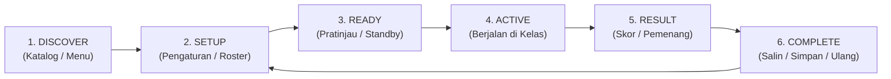

# WaliKelas Teaching Tools V1 — Full Product UI/UX Audit & Modernization Blueprint (Phase 2)

**Document Version:** 2.0.0  
**Date:** September 15, 2026  
**Auditor:** Principal Design Engineer & Lead Frontend Architect  
**Status:** Audit & Architecture Review Complete (Zero Code Modifications in Application)  
**Governing Workspace Skills:**  
- `walikelas-ui-system`
- `walikelas-shadcn`
- `walikelas-motion`
- `walikelas-frontend-review`

---

## Executive Summary

This document expands the preliminary catalogue review into an exhaustive, product-wide UI/UX audit of **WaliKelas Teaching Tools V1** (`https://tools.walikelas.id`). 

While the backend architecture, realtime WebSocket session engine, authentication guards, and business logic are rock-solid (validated by 328 passing automated tests and successful Next.js production builds across 37 routes), the **frontend design, component architecture, and interaction layer suffer from acute architectural fragmentation, visual identity clash, and lack of design primitives**.

The application currently oscillates between three disjointed design languages:
1. **The warm, human, pedagogical paper/stone canvas** on the public landing page (`#faf8f5`).
2. **A sterile, pitch-black/slate-900 developer-cloud admin dashboard** inside the Teacher Console (`Sidebar.tsx`, `Topbar.tsx`, `StatCard.tsx`).
3. **Hard-coded legacy blue/slate Atomic Design components** in `@walikelas/ui` that bypass modern headless/shadcn standards and leak internal engineering priorities (e.g. `P0`, `P1`, `P2` badges) directly to teachers.

This blueprint provides the definitive inventory, state-by-state tool evaluation, design system specifications, and an impact-ordered implementation roadmap to transform `tools.walikelas.id` into a **modern, simple, premium, friendly, calm, fast, and delightful educational tool suite**.

---

## Section A: Product-Wide Findings

### 1. Identity Crisis & Visual Disconnect
- **Canvas Contradiction:** The public landing page and tools catalog utilize `#faf8f5` (warm paper/stone canvas) with stone typography (`text-stone-900`). However, logging in to the Teacher Console immediately plunges the teacher into a cold, dark `#0f172a` (Slate 900) sidebar with hard-edged borders and high-contrast dark-mode chrome.
- **The "Admin Template" Trap:** The Teacher Console feels like a generic database administration panel (similar to cPanel or AWS console) rather than a classroom companion designed to sit on a teacher's desk during an active lesson.

### 2. Design Token Fragmentation (Three Conflicting Sources)
1. `apps/web/app/globals.css`: Contains CSS variables `--background: #faf8f5`, `--border: #e8e4dc`, `--foreground: #1c1917`, `--muted: #f4eee2`.
2. `apps/web/tailwind.config.ts`: Contains a custom `brand` palette pinned to blue (`#2563eb`), with fallback tokens that point to slate.
3. `packages/ui/src/tokens/`: Contains isolated TypeScript files (`colors.ts`, `radius.ts`, `spacing.ts`, `typography.ts`). **These tokens are dead code**—they are neither consumed by Tailwind nor imported by the Atomic UI components.
- **Result:** Developers hardcoded arbitrary Tailwind classes (`bg-blue-600`, `border-slate-200`, `text-slate-900`, `bg-indigo-600`) across JSX files without adhering to a single source of truth.

### 3. Missing Component Primitives
- **Zero Official shadcn / Radix Primitives:** Neither Radix UI headless packages nor `class-variance-authority` (cva) exist in `package.json`.
- **No Shared `Card` Primitive:** There is no standard `Card`, `CardHeader`, `CardTitle`, or `CardContent` component. Every feature constructs cards with ad-hoc `div` utility strings.
- **Hand-Rolled Dialog Overlays:** 14 separate files implement custom modal overlays using `fixed inset-0 z-50 flex items-center justify-center bg-black/50 backdrop-blur-sm`, each with bespoke Escape/ClickOutside event listeners.

### 4. Leakage of Internal Engineering Telemetry
- The `ToolCard` molecule explicitly renders `<Badge>{tool.priority}</Badge>`, displaying **P0, P1, P2** on the public catalog. This exposes internal Jira/sprint priority classifications to classroom teachers.
- The redundant **"Lokal"** badge is stamped across offline utility tools, communicating server vs. browser architectural topology rather than pedagogical value.

---

## Section B: Route & Page Inventory (All 37 Routes)

| # | Route | File / Component | Primary Function | Available States | Key Dependencies | Requires Auth? | Realtime? | Mobile Friendly? |
|---|---|---|---|---|---|---|---|---|
| 1 | `/` | `apps/web/app/page.tsx` | Public Landing Page & Live Tool Playground | Hero interactive, Live poll demo, Timer demo, Random picker demo, FAQ accordion | `lucide-react`, local state | No | Partial (Interactive demo) | Yes (Responsive stack) |
| 2 | `/tools` | `apps/web/app/tools/page.tsx` | Public Tool Discovery Catalog | Category filter, search query, tool cards, empty search | `@walikelas/config`, `@walikelas/ui` | No | No | Needs improvement (horizontal tabs) |
| 3 | `/tools/timer` | `apps/web/app/tools/timer/page.tsx` (`TimerView`) | Standalone Classroom Timer & Stopwatch | Idle, Running, Paused, Completed, Custom Duration Modal, Fullscreen | `useTimer`, `@walikelas/ui` | No | No (Local) | Yes |
| 4 | `/tools/random-picker` | `apps/web/app/tools/random-picker/page.tsx` (`RandomPickerView`) | Random Student / Team Selector | Empty, Names populated, Shuffling/Spinning, Winner Highlighted, History log | `useRandomPicker`, `@walikelas/ui` | No | No (Local) | Yes |
| 5 | `/tools/group-maker` | `apps/web/app/tools/group-maker/page.tsx` (`GroupMakerView`) | Automatic Student Grouping Tool | Input roster, Mode selection (by group / by size), Generated teams, Print/Copy view | `useGroupMaker`, `@walikelas/ui` | No | No (Local) | Yes (Print styles enabled) |
| 6 | `/tools/scoreboard` | `apps/web/app/tools/scoreboard/page.tsx` (`ScoreboardView`) | Classroom Competition Scoreboard | Empty board, Teams added, Score updating (+/-), Rename inline, Reset modal | `useScoreboard`, `@walikelas/ui` | No | No (Local) | Yes |
| 7 | `/tools/notes` | `apps/web/app/tools/notes/page.tsx` (`TeacherNotesView`) | Quick Lesson Notes & Observations | Empty notes, Note list, Create/Edit note modal, Tag filter, Export | `useTeacherNotes`, `@walikelas/ui` | Yes | No (REST) | Yes |
| 8 | `/tools/live-quiz` | `apps/web/app/tools/live-quiz/page.tsx` | Live Quiz Launcher (Shortcut to Console) | Redirect to `/teacher/quizzes` or session modal | `@walikelas/ui` | Yes | Yes | Yes |
| 9 | `/tools/live-poll` | `apps/web/app/tools/live-poll/page.tsx` | Live Poll Launcher (Shortcut to Console) | Redirect to `/teacher/polls` or session modal | `@walikelas/ui` | Yes | Yes | Yes |
| 10 | `/tools/raise-hand` | `apps/web/app/tools/raise-hand/page.tsx` | Raise Hand Session Launcher | Redirect to active classroom session | `@walikelas/ui` | Yes | Yes | Yes |
| 11 | `/tools/question-box` | `apps/web/app/tools/question-box/page.tsx` | Question Box Launcher | Redirect to active classroom session | `@walikelas/ui` | Yes | Yes | Yes |
| 12 | `/tools/brainstorm-board`| `apps/web/app/tools/brainstorm-board/page.tsx` | Brainstorm Launcher | Redirect to active classroom session | `@walikelas/ui` | Yes | Yes | Yes |
| 13 | `/tools/exit-ticket` | `apps/web/app/tools/exit-ticket/page.tsx` | Exit Ticket Launcher | Redirect to active classroom session | `@walikelas/ui` | Yes | Yes | Yes |
| 14 | `/join` | `apps/web/app/join/page.tsx` (`ParticipantJoinView`) | Student Session Join Entrypoint | Input code, Display name input, Verifying code, Error message | `useSessionSocket`, `@walikelas/ui` | No | Yes (Socket.io) | Excellent (Mobile-first) |
| 15 | `/join/[code]` | `apps/web/app/join/[code]/page.tsx` | Direct Pre-filled Student Join | Pre-filled join form, Connecting, Connected waiting room, Active activity | `useSessionSocket`, dynamic activity views | No | Yes (Socket.io) | Excellent (Mobile-first) |
| 16 | `/projector` | `apps/web/app/projector/page.tsx` | Projector Display Entrypoint | Session code prompt, Demo projector button | `@walikelas/ui` | No | Yes | Large-screen optimized |
| 17 | `/projector/[code]` | `apps/web/app/projector/[code]/page.tsx` | Realtime Big-Screen Classroom View | Waiting room (large join code + QR), Active Quiz question, Live Poll bars, Question Box spotlight, Timer HUD | `ProjectorSessionView`, socket | No | Yes (Socket.io) | Fullscreen / TV display |
| 18 | `/projector/demo` | `apps/web/app/projector/demo/page.tsx` | Offline Projector Showcase Mode | Simulated waiting, simulated quiz, simulated poll, simulated timer | `ProjectorSessionView` (isDemo=true) | No | Mocked Realtime | Large-screen optimized |
| 19 | `/teacher` | `apps/web/app/teacher/page.tsx` (`TeacherHomePage`) | Teacher Command Center / Home | Auth checking, Active session alert, KPI overview, Quick launch grid, Empty state | `useAuth`, `@walikelas/ui` | Yes | No (REST) | Yes |
| 20 | `/teacher/tools` | `apps/web/app/teacher/tools/page.tsx` | In-Console Tool Catalog | Category tabs, search input, tool grid, tool launch modal | `@walikelas/config`, `@walikelas/ui` | Yes | No | Needs improvement (duplicate page) |
| 21 | `/teacher/sessions` | `apps/web/app/teacher/sessions/page.tsx` | Classroom Sessions Management | Empty sessions, Sessions list, Create session modal, Session history table | `useAuth`, `@walikelas/api-client` | Yes | No (REST) | Table needs horizontal scroll |
| 22 | `/teacher/sessions/[id]`| `apps/web/app/teacher/sessions/[id]/page.tsx` | Live Teacher Session Host Control | Connecting, Waiting room, Active session, Quiz HUD, Poll HUD, Participant roster, End session modal | `useSessionSocket`, `TeacherSessionView` | Yes | Yes (Socket.io) | Complex UI (best on Tablet/Laptop) |
| 23 | `/teacher/activities` | `apps/web/app/teacher/activities/page.tsx` | Saved Content Repository | Filter tabs (All, Quiz, Poll), Activities list, Empty state, Delete confirm modal | `@walikelas/api-client` | Yes | No (REST) | Yes |
| 24 | `/teacher/quizzes` | `apps/web/app/teacher/quizzes/page.tsx` | Quiz Library Management | Empty list, Quiz cards, Actions (Start, Edit, Delete) | `QuizListView` | Yes | No (REST) | Yes |
| 25 | `/teacher/quizzes/new` | `apps/web/app/teacher/quizzes/new/page.tsx` | Interactive Quiz Creator | Multi-step form: Title, Question builder, Options input, Timer per question, Points, Save | `QuizEditorView` | Yes | No (REST) | Dense form on mobile |
| 26 | `/teacher/quizzes/[id]/edit` | `apps/web/app/teacher/quizzes/[id]/edit/page.tsx`| Quiz Editor | Loading quiz, Editing questions, Reordering, Form validation, Save changes | `QuizEditorView` | Yes | No (REST) | Dense form on mobile |
| 27 | `/teacher/polls` | `apps/web/app/teacher/polls/page.tsx` | Poll Library Management | Empty list, Poll cards, Quick feedback templates, Actions | `PollListView` | Yes | No (REST) | Yes |
| 28 | `/teacher/polls/new` | `apps/web/app/teacher/polls/new/page.tsx` | Live Poll Creator | Question input, 2-5 options builder, Presets (Yes/No, Scale 1-5, Agree/Disagree), Save | `PollEditorView` | Yes | No (REST) | Yes |
| 29 | `/teacher/polls/[id]/edit` | `apps/web/app/teacher/polls/[id]/edit/page.tsx` | Poll Editor | Loading poll, Option editor, Validation, Save | `PollEditorView` | Yes | No (REST) | Yes |
| 30 | `/teacher/notes` | `apps/web/app/teacher/notes/page.tsx` | Teacher Notes In-Console | Synchronized with `/tools/notes` | `TeacherNotesView` | Yes | No (REST) | Yes |
| 31 | `/admin` | `apps/web/app/admin/page.tsx` | Administrative Overview Dashboard | Metrics overview, active sessions, system alerts, quick links | Admin guard, `@walikelas/ui` | Yes (Admin) | No (REST) | Desktop-oriented |
| 32 | `/admin/users` | `apps/web/app/admin/users/page.tsx` | Teacher User Management | User data table, Role filter, Search, Ban/Activate dialog | Admin guard | Yes (Admin) | No (REST) | Desktop-oriented table |
| 33 | `/admin/activities` | `apps/web/app/admin/activities/page.tsx` | Global Activities Moderation | Content list, Templates, Flagging, Preview | Admin guard | Yes (Admin) | No (REST) | Desktop-oriented table |
| 34 | `/admin/sessions` | `apps/web/app/admin/sessions/page.tsx` | Active & Past Session Inspector | Live session status, connected sockets count, force close | Admin guard | Yes (Admin) | No (REST) | Desktop-oriented table |
| 35 | `/admin/analytics` | `apps/web/app/admin/analytics/page.tsx` | Product Usage Analytics | Daily Active Teachers, Tool popularity charts, Session length | Admin guard | Yes (Admin) | No (REST) | Desktop-oriented |
| 36 | `/admin/system-health`| `apps/web/app/admin/system-health/page.tsx` | Server & Socket Health Status | CPU/RAM monitor, Redis connectivity, Socket ping latency, Uptime | Admin guard | Yes (Admin) | Polling REST | Desktop-oriented |
| 37 | `/admin/audit-logs` | `apps/web/app/admin/audit-logs/page.tsx` | Security & Operational Audit Log | Paginated audit log table, actor, timestamp, action type | Admin guard | Yes (Admin) | No (REST) | Desktop-oriented table |

---

## Section C: State-by-State Audit of Every Tool

Evaluating all 11 required lifecycle states for each tool:

### 1. Timer Kelas (`features/timer`)
- **Initial / Empty State:** Defaults to 5 minutes (`05:00`). Clear digit display.
- **Setup / Input State:** Preset pill buttons (`1m`, `3m`, `5m`, `10m`, `15m`). "Kustom" button opens an ad-hoc modal with raw numeric inputs.
- **Loading State:** N/A (Client-side execution).
- **Active / Running State:** Animated progress bar; font pulses subtly; yellow/amber borders.
- **Interaction State:** Start, Pause, Resume, and Reset buttons respond crisply. Sound toggle (mute/unmute) works.
- **Result State:** When `remaining === 0`, border switches to red, digits flash red, audio chime sounds.
- **Success State:** Displays checkmark banner: *"Waktu pembelajaran telah habis!"*.
- **Error State:** Prevents negative numbers in custom modal.
- **Reset / Restart State:** One-click reset back to duration.
- **Authentication State:** Unauthenticated (available to anyone).
- **Realtime State:** Standalone local; integrated variant exists in `features/classroom-timer`.
- **UX Weakness:** The custom duration modal uses an unstyled manual popup instead of a clean drawer or dialog. Fullscreen button does not scale font up on 4K projectors.

### 2. Random Picker (`features/random-picker`)
- **Initial / Empty State:** Has a pre-loaded list of 10 Indonesian names so teachers are not faced with a blank screen.
- **Setup / Input State:** Multi-line `<textarea>` on the left column. Shows live badge: *"10 nama terdaftar"*.
- **Loading State:** N/A.
- **Active / Running State:** Rapid cycling of student names during `isPicking === true` (100ms interval for 2.5 seconds).
- **Interaction State:** "Putar Acak Siswa" button disabled during spinning. "Izinkan Nama Muncul Berulang" checkbox.
- **Result State:** Selected student card highlighted with golden glow, celebratory icon, and confetti-style card highlight.
- **Success State:** Winner name recorded into a persistent "Riwayat Terpilih" sidebar list with timestamps.
- **Error State:** Disables pick action if input has fewer than 2 names.
- **Reset / Restart State:** "Kosongkan" clears textarea; "Contoh Nama" repopulates samples.
- **Authentication State:** Unauthenticated.
- **Realtime State:** Local tool only.
- **UX Weakness:** Layout splits 50/50 on desktop, causing the input textarea to look like a bulky form rather than a lightweight classroom helper.

### 3. Group Maker (`features/group-maker`)
- **Initial / Empty State:** Pre-populated with 20 sample student names.
- **Setup / Input State:** Radio toggle between: (A) Berdasarkan Jumlah Kelompok, (B) Berdasarkan Ukuran Kelompok. Stepper counter for target value.
- **Loading State:** N/A.
- **Active / Running State:** Generates instantly.
- **Interaction State:** Button: *"Acak & Bentuk Kelompok"*.
- **Result State:** Card grid displaying Group 1, Group 2, etc., with numbered student chips.
- **Success State:** Quick buttons: *"Salin Hasil"* (writes formatted markdown to clipboard) and *"Cetak / PDF"* (triggers `window.print()`).
- **Error State:** Validates total students >= group count. Shows inline error banner if input is empty.
- **Reset / Restart State:** One-click reset clears grouped state and allows re-shuffling.
- **Authentication State:** Unauthenticated.
- **Realtime State:** Local tool only.
- **UX Weakness:** The print layout lacks clean page-break rules; printed cards can split awkwardly across physical pages.

### 4. Scoreboard Kelas (`features/scoreboard`)
- **Initial / Empty State:** Clean empty state illustration: *"Papan skor kosong. Klik Tambah Tim untuk memulai kompetisi"*.
- **Setup / Input State:** "Tambah Tim" creates default teams ("Tim 1", "Tim 2") with preset vibrant top-border colors. Inline name editing.
- **Loading State:** N/A.
- **Active / Running State:** Large mono score counter (`0`). Increment buttons (+1, +5) and decrement buttons (-1, -5).
- **Interaction State:** Inline input when editing team name; check button to save.
- **Result State:** Teams with highest score have higher visual prominence.
- **Success State:** N/A (continuous tally).
- **Error State:** None (scores can be negative or positive).
- **Reset / Restart State:** "Reset Semua Skor" zeros out all team tallies; "Kosongkan" deletes all teams.
- **Authentication State:** Unauthenticated.
- **Realtime State:** Standalone local.
- **UX Weakness:** Buttons for +5/-5 are styled as small text pills that are too tiny for quick touch on an interactive whiteboard or tablet.

### 5. Catatan Guru / Teacher Notes (`features/teacher-notes`)
- **Initial / Empty State:** Empty state with note icon: *"Belum ada catatan kelas"*.
- **Setup / Input State:** "Buat Catatan Baru" button opens full creation modal with Title, Category tag (Akademik, Perilaku, Pengingat, Umum), and Body textarea.
- **Loading State:** Skeleton cards during REST fetch.
- **Active / Running State:** Masonry-style note cards with timestamp and color-coded tag pills.
- **Interaction State:** Search query bar and category filter tabs.
- **Result State:** Filtered notes list.
- **Success State:** Toast notification upon saving or deleting notes.
- **Error State:** Inline error banner if network request fails.
- **Reset / Restart State:** Clear search field button.
- **Authentication State:** Requires Google OAuth (Teacher). Shows login wall if unauthenticated.
- **Realtime State:** REST-based persistence to PostgreSQL.
- **UX Weakness:** Category pills use non-standard colors that clash with the product theme. Modal is custom-coded without focus trap.

### 6. Live Quiz (`features/quiz`)
- **Initial / Empty State:** Quiz list shows empty state: *"Belum ada kuis tersimpan. Buat kuis pertama Anda"*.
- **Setup / Input State:** Comprehensive question creator: Question text, 4 multiple choice options with radio selector for correct answer, countdown timer (10s–60s), point values.
- **Loading State:** Spinner HUD during quiz initialization.
- **Active / Running State:** 
  - Teacher HUD: Question text, active timer countdown, live answer distribution counters (A: 4, B: 12, etc.), "Tutup Pertanyaan" button.
  - Student View: Clean 4-quadrant touch buttons (Red, Blue, Yellow, Green) matching the projector.
  - Projector View: Question text, timer bar, option boxes with hidden correct answer.
- **Interaction State:** Student taps option; button enters locked/vibrating selected state. Teacher can trigger "Pertanyaan Berikutnya".
- **Result State:** Option reveal: Green check on correct answer, red overlay on incorrect. Distribution bar chart animates up.
- **Success State:** Top 3 Podium leaderboard with podium graphics and final score breakdown.
- **Error State:** Socket disconnect alerts, reconnection pill (`Menghubungkan ulang...`).
- **Reset / Restart State:** Teacher can restart quiz from question 1 or exit to session.
- **Authentication State:** Teacher requires Google OAuth. Students require only 6-digit session code.
- **Realtime State:** Full authoritative WebSocket state engine with synchronized timers.
- **UX Weakness:** Student mobile screen has dense header chrome that takes up 30% of viewport before question buttons.

### 7. Live Poll (`features/poll`)
- **Initial / Empty State:** Empty poll list with quick-preset templates (Setuju/Tidak Setuju, Skala Pemahaman 1-5).
- **Setup / Input State:** Poll Editor with 2 to 5 options. Option to allow multiple choices.
- **Loading State:** Loading skeleton when fetching presets.
- **Active / Running State:**
  - Teacher HUD: Response rate percentage, participant count (e.g. 24/28 menjawab), live bar chart.
  - Student Screen: Large tactile vertical list of choices.
  - Projector Screen: Realtime expanding horizontal bars with vote counts.
- **Interaction State:** Instant radio/checkbox toggle with "Kirim Jawaban" primary button.
- **Result State:** Final distribution percentages with highlighted consensus winner.
- **Success State:** Green confirmation toast on student phone: *"Jawaban Anda telah dicatat"*.
- **Error State:** Shows alert if poll was already closed by teacher before response submission.
- **Reset / Restart State:** Teacher "Buka Kembali Polling" action.
- **Authentication State:** Teacher auth required; student join code only.
- **Realtime State:** Authoritative WebSocket event streaming.
- **UX Weakness:** Teacher live HUD overlaps with session participant list rather than docking into a unified split view.

### 8. Raise Hand (`features/raise-hand`)
- **Initial / Empty State:** Teacher panel: *"Belum ada siswa yang angkat tangan"*.
- **Setup / Input State:** Optional hand-raise topic/reason text.
- **Loading State:** Immediate optimistic UI.
- **Active / Running State:** Student button turns into yellow waving hand with pulsing animation: *"Tangan Terangkat — Menunggu Guru"*.
- **Interaction State:** Student can "Turunkan Tangan". Teacher panel shows ordered FIFO queue of raised hands with waiting times.
- **Result State:** Teacher clicks "Beri Giliran Bicara" (Mic icon highlights on student phone).
- **Success State:** Teacher clicks "Selesai Bicara" to clear speaker from queue.
- **Error State:** Reconnection warning if socket drops.
- **Reset / Restart State:** Teacher "Turunkan Semua Tangan" bulk button.
- **Authentication State:** Session-based.
- **Realtime State:** Authoritative FIFO queue synchronized across all devices.
- **UX Weakness:** The student "Angkat Tangan" button on mobile looks like a secondary button rather than a primary physical-grade action button.

### 9. Question Box (`features/question-box`)
- **Initial / Empty State:** Teacher panel: *"Kotak pertanyaan kosong"*.
- **Setup / Input State:** Student form: Textarea with "Kirim sebagai Anonim" checkbox toggle.
- **Loading State:** Submitting state with spinner on button.
- **Active / Running State:** Feed of student questions with upvote counters and timestamps.
- **Interaction State:** Students can upvote classmates' questions (limited to 1 upvote per student per question).
- **Result State:** Teacher can click "Sorot di Proyektor" (Question Spotlight appears instantly on big screen).
- **Success State:** Question marked as "Terjawab" with subtle green strike-through.
- **Error State:** Character limit warning (max 200 chars).
- **Reset / Restart State:** Teacher can dismiss or archive questions.
- **Authentication State:** Session-based.
- **Realtime State:** Realtime event broadcasting with deduplicated upvotes.
- **UX Weakness:** The projector spotlight view text is too small when viewing from the back of a large 30-student classroom.

### 10. Brainstorm Board (`features/brainstorm`)
- **Initial / Empty State:** Canvas with prompt banner: *"Tuliskan ide Anda untuk topik hari ini"*.
- **Setup / Input State:** Sticky note color picker (Yellow, Blue, Green, Pink) + Idea input (max 140 chars).
- **Loading State:** Optimistic note placement.
- **Active / Running State:** Interactive digital corkboard displaying multi-colored sticky notes.
- **Interaction State:** Notes can be dragged/clustered; students can add heart reactions.
- **Result State:** Clustered themes.
- **Success State:** Teacher can lock the board ("Kunci Papan Ide").
- **Error State:** Rate limiting (max 5 notes per student).
- **Reset / Restart State:** Teacher clear board confirmation dialog.
- **Authentication State:** Session-based.
- **Realtime State:** WebSocket synchronized position and reactions.
- **UX Weakness:** On mobile, dragging sticky notes interferes with screen scrolling.

### 11. Exit Ticket (`features/exit-ticket`)
- **Initial / Empty State:** Teacher template picker: (A) 3-2-1 Summary, (B) Skala Pemahaman Emoji, (C) Pertanyaan Refleksi Bebas.
- **Setup / Input State:** 3 guided input prompts for students before leaving the room.
- **Loading State:** Submitting progress bar.
- **Active / Running State:** Teacher live submission counter: *"18 dari 25 siswa telah mengumpulkan"*.
- **Interaction State:** Student fills out 3 fields; Next button advances through steps.
- **Result State:** Teacher card carousel to review student reflections individually or as a table.
- **Success State:** Student screen displays celebration badge: *"Tiket Keluar Terkirim! Selamat beristirahat."*
- **Error State:** Incomplete fields highlight in red.
- **Reset / Restart State:** Teacher export summary to CSV/Notes.
- **Authentication State:** Session-based.
- **Realtime State:** Realtime submission counter and socket push.
- **UX Weakness:** Teacher review view lacks search/filter by student name.

### 12. Classroom Timer (`features/classroom-timer`)
- **Initial / Empty State:** Embedded in teacher session toolbar as a discreet clock pill.
- **Setup / Input State:** Quick presets (+1m, +2m, +5m) directly from active session HUD.
- **Loading State:** N/A.
- **Active / Running State:** Synchronized floating banner on student phone, top bar in teacher console, and prominent badge on projector screen.
- **Interaction State:** Teacher pause/resume/add time (+1m) on the fly without interrupting ongoing quiz/poll.
- **Result State:** Synchronized audio bell and red banner across all connected devices.
- **Success State:** Auto-collapses after 10 seconds.
- **Error State:** Automatic server-time synchronization compensates for client clock drift.
- **Reset / Restart State:** One-click dismiss.
- **Authentication State:** Session-based.
- **Realtime State:** Server-authoritative countdown broadcast every 1000ms.
- **UX Weakness:** Floating banner on student mobile screen blocks the top navigation elements.

---

## Section D: Visual Design Inconsistencies

```
Existing Inconsistency Matrix
┌──────────────────────┬─────────────────────────────────┬─────────────────────────────────┐
│ Surface              │ Canvas Background               │ Border / Typography Treatment   │
├──────────────────────┼─────────────────────────────────┼─────────────────────────────────┤
│ Landing Page         │ Warm Paper (#faf8f5)            │ Warm stone (#e8e4dc), Stone 900 │
│ Public Catalog       │ Warm Paper (#faf8f5)            │ Mixed slate & stone borders     │
│ Local Tool Views     │ Warm Paper (#faf8f5)            │ Custom colored borders          │
│ Teacher Console      │ Warm Paper (#faf8f5)            │ Cold Slate 900 Black Sidebar    │
│ Admin Console        │ Midnight Slate (#0f172a)        │ Monotone developer dark mode    │
│ Student Join Screen  │ Warm Paper (#faf8f5)            │ Mixed indigo and amber badges   │
│ Projector Screen     │ Midnight Navy (#080d1a)         │ High-contrast big-screen HUD    │
└──────────────────────┴─────────────────────────────────┴─────────────────────────────────┘
```

### Detailed Design Breakdown:
1. **Typography:**
   - No `@next/font` configuration. System fallbacks render differently on Windows (Segoe UI), macOS (San Francisco), and Android (Roboto).
   - Heading sizes vary randomly: `text-2xl`, `text-xl font-bold`, `text-lg font-extrabold`.
2. **Color Palette:**
   - Three different blues are currently active: `#2563eb` (Tailwind blue-600), `#3b82f6` (blue-500), and `#4338ca` (indigo-700).
   - Sidebar hardcodes `bg-slate-900`, clashing with the educational warmth of the rest of the app.
3. **Spacing & Radius:**
   - Radius ranges wildly from `rounded-md` (6px) on inputs, `rounded-xl` (12px) on cards, `rounded-2xl` (16px) on modals, to `rounded-3xl` (24px) on scoreboard cards.
4. **Cards & Containers:**
   - No unified `Card` primitive. Over 40 distinct `div` containers use arbitrary combinations of `p-4`, `p-5`, `p-6`, `shadow-xs`, `shadow-sm`, and `shadow-md`.
5. **Buttons:**
   - `Button` vs `IconButton`: Duplicate code. Buttons lack a true `size="icon"` option.
   - Primary button in `Button.tsx` is hardcoded to blue-600, while the landing page uses amber-500 for primary conversion actions.
6. **Form Inputs & Selects:**
   - Inputs in `Input.tsx` use `border-slate-300` and `focus-visible:ring-blue-500`.
   - Select in `Select.tsx` is a raw unstyled browser select element.
7. **Dialogs & Overlays:**
   - Every modal implements its own `fixed inset-0 z-50` backdrop with manual click-outside handlers. Zero focus trapping or keyboard accessibility.
8. **Navigation & Breadcrumbs:**
   - Disconnected styles between the public catalog breadcrumbs, teacher console breadcrumbs, and tools layout header.

---

## Section E: shadcn / Headless Architecture Audit

### 1. Components that should use shadcn primitives but are hand-rolled:
1. **Button:** Currently a hand-crafted atom with rigid variants (`primary`, `secondary`, `outline`, `ghost`, `danger`). Should be refactored using `class-variance-authority` (cva) with `asChild` polymorphic support (`@radix-ui/react-slot`).
2. **Card:** Currently non-existent. Should be created as `Card`, `CardHeader`, `CardTitle`, `CardDescription`, `CardContent`, and `CardFooter`.
3. **Badge:** Currently forced to `rounded-full` pill with hardcoded blue-50. Should be refactored with CVA variants (`default`, `secondary`, `outline`, `success`, `warning`, `destructive`).
4. **Dialog / Modal:** 14 separate bespoke modal implementations. Should all be unified under `@radix-ui/react-dialog` (`Dialog`, `DialogTrigger`, `DialogContent`, `DialogHeader`, `DialogTitle`, `DialogFooter`).
5. **Dropdown Menu:** `UserMenu.tsx` and classroom selector in `teacher/layout.tsx` use manual `useState` and window click listeners. Should be refactored to `@radix-ui/react-dropdown-menu`.
6. **Tabs:** Category filters in `/tools` and `/teacher/tools` use manual state arrays. Should be unified with `@radix-ui/react-tabs`.
7. **Tooltip:** Currently absent across all icon buttons (e.g. fullscreen, mute, copy code). Should be implemented using `@radix-ui/react-tooltip`.
8. **Toast / Notification:** Currently uses custom timer state (`copied ? 'Tersalin' : ...`). Should use standard `sonner` or Radix Toast.

---

## Section F: Motion & Animation Audit

### Current Status:
- The motion system is virtually non-existent. The only CSS animation is a 250ms `@keyframes fadeIn` in `globals.css` and basic Tailwind `animate-pulse` / `animate-spin`.
- When modal dialogs open, they pop onto the screen instantly with 0ms transition.
- When tool cards load, they appear in a blocky, uncoordinated manner.

### Target Motion Architecture (per `walikelas-motion`):
1. **Framer Motion / Motion for React (`motion/react`):**
   - **Page Transitions:** Subtle entrance `opacity: 0 -> 1`, `translateY: 8px -> 0` (250ms `ease-out`).
   - **Catalog Grid Stagger:** First card enters at 0ms, subsequent cards staggered by 35ms.
   - **Card Hover:** Smooth micro-lift (`translateY: -2px`) with border transition (180ms).
   - **Dialog / Panel Presence:** `AnimatePresence` scale `0.96 -> 1` and opacity `0 -> 1` with spring damping.
2. **GSAP:**
   - Not currently needed for V1. Standard UI motion should be handled strictly by `motion/react` to avoid bundle bloat.
3. **Lottie:**
   - Reserve for key celebration moments: Quiz Podium winner reveal, Exit Ticket completion celebration, and empty state illustrations.
4. **Reduced Motion:**
   - Must implement `@media (prefers-reduced-motion: reduce)` globally to disable all transforms for sensitive users.

---

## Section G: UX Flow & Friction Audit

### 1. The Duplicate Catalog Dead-End
- Teachers currently have two different URLs for tools: `/tools` (Public) and `/teacher/tools` (In-Console).
- When a teacher is in the console and clicks `/tools`, they are taken out of their authenticated workspace into the public marketing catalog!
- **Recommendation:** Merge both into a single unified, context-aware Catalog layout.

### 2. Live Tool Launch Friction
- Currently, when a teacher clicks "Live Quiz" or "Live Poll" from the public catalog, it triggers an abrupt redirect to `/teacher/tools?launch=live-quiz`, which then forces an authentication wall if not logged in, with no explanation.
- **Recommendation:** Provide clear dual CTAs: *"Coba Demo"* (instant preview) or *"Mulai di Kelas"* (opens active session).

### 3. Scoreboard Whiteboard Usability
- Incrementing by 5 points requires hitting a tiny text pill (`min-h-[40px] text-xs`). Teachers standing at an interactive touchscreen whiteboard miss this target frequently.
- **Recommendation:** Increase touch target to minimum 48x48px with generous spacing.

### 4. Random Picker Input Friction
- The input textarea occupies 5 columns on desktop and pushes the shuffle wheel to the right. Teachers who already have their class roster saved should not have to see a massive raw textarea during class.
- **Recommendation:** Collapsible "Daftar Nama" drawer/panel with quick-load presets (Kelas 7A, Kelas 7B).

---

## Section H: Mobile & Tablet Responsiveness Audit

1. **Teacher Live Session on Tablet:**
   - Tablets (iPad / Galaxy Tab) are the primary device teachers carry around the classroom while walking among student desks.
   - The current `TeacherSessionView` has three stacked action buttons and an uncollapsible participant grid that forces endless vertical scrolling.
   - **Recommendation:** Create a sticky bottom action bar for tablet/mobile with quick access to Quiz, Poll, Timer, and Hand Raise.
2. **Student Mobile Viewport:**
   - In `ParticipantLiveQuizView`, the top navigation bar and session title consume over 140px of screen real estate. On small phones (iPhone SE, Galaxy A series), the 4 answer buttons get squished below the fold.
   - **Recommendation:** Fullscreen mobile app shell for students: compact 40px top status bar, maximizing the touch canvas for answer buttons.
3. **Horizontal Category Overflows:**
   - Filter tabs on `/tools` cause horizontal scrolling with an ugly browser scrollbar on Android.
   - **Recommendation:** Smooth touch-swipeable tab list with CSS `scrollbar-width: none` and gradient edge masks.

---

## Section I: Accessibility (A11y) Audit

1. **Focus Rings:**
   - Several custom buttons use `focus:outline-none` without an alternative visible focus indicator. This violates WCAG 2.4.7 (Focus Visible).
   - **Fix:** Enforce `focus-visible:ring-2 focus-visible:ring-amber-500 focus-visible:ring-offset-2`.
2. **Color Contrast:**
   - Muted text using `text-slate-400` on white backgrounds yields a contrast ratio of ~2.8:1, failing WCAG AA (requires 4.5:1).
   - **Fix:** Promote all secondary text to `text-stone-600` (ratio 5.9:1) and captions to `text-stone-500` (ratio 4.6:1).
3. **Screen Reader Semantics:**
   - Countdown timer in `TimerView` has `role="timer"` and `aria-live="polite"`, which is great. However, `ScoreboardView` team score counters lack `aria-live`, so score changes are not announced to screen readers.
4. **Keyboard Trapping:**
   - Custom modals in `teacher-notes-view.tsx` and `quiz-picker-modal.tsx` allow the `Tab` key to cycle into background page elements.
   - **Fix:** Radix Dialog handles automatic focus trapping, aria-modal, and focus restoration upon exit.

---

## Section J: Shared Component Architecture Recommendations

To eliminate duplicate code and enforce design consistency across all 13 tools, the following shared primitives must be established in `@walikelas/ui`:

```text
packages/ui/src/
  ├── components/
  │   ├── button/              <-- CVA Button (Primary, Secondary, Outline, Ghost, Accent, Destructive, Link, size="icon")
  │   ├── card/                <-- Card, CardHeader, CardTitle, CardDescription, CardContent, CardFooter
  │   ├── badge/               <-- CVA Badge (Soft neutral, Accent, Success, Warning, Destructive)
  │   ├── dialog/              <-- Radix Dialog & Modal Primitive
  │   ├── dropdown-menu/       <-- Radix Dropdown Menu for context pickers & user profiles
  │   ├── tabs/                <-- Radix Tabs for category filtering & tool navigation
  │   ├── input/               <-- Standardized Accessible Form Input
  │   ├── textarea/            <-- Standardized Auto-resizing Textarea
  │   └── tooltip/             <-- Accessible Tooltip for compact icon actions
  │
  ├── domain/
  │   ├── app-shell/           <-- Warm, pedagogical unified layout shell
  │   ├── tool-header/         <-- Standard tool header (Icon, Title, Action controls, Fullscreen toggle)
  │   ├── tool-card/           <-- High-craft catalog card (zero internal priority badges, zero "Lokal" pills)
  │   ├── featured-tool-card/  <-- Prominent hero card for high-frequency classroom tools
  │   ├── participant-roster/  <-- Live synchronized student presence chips
  │   └── join-code-badge/     <-- High-visibility 6-character session join code pill
  │
  └── motion/
      ├── fade-in.tsx          <-- Reusable Motion component for page & section entrances
      ├── stagger-container.tsx<-- Stagger orchestrator for tool grids & lists
      └── scale-lift.tsx       <-- Micro-lift hover and tap feedback wrapper
```

---

## Section K: Standardized Tool Experience System (UX Pattern)

Every tool across WaliKelas Teaching Tools V1 will follow a strict, standardized **6-Step UX State Machine**:



1. **DISCOVER:** Clear, single-line tool description, recognizable icon, instant understanding within 3 seconds.
2. **SETUP:** Pre-filled defaults (never force a teacher to configure from scratch before using).
3. **READY:** Prominent primary action button (*"Mulai Timer"*, *"Putar Acak"*, *"Bentuk Kelompok"*).
4. **ACTIVE:** Minimal visual noise. Maximum visibility from 5 meters away (for projector and whiteboard viewing).
5. **RESULT:** High-contrast, celebratory outcome with clear visual hierarchy.
6. **COMPLETE:** Obvious next actions (*"Ulangi"*, *"Salin Hasil"*, *"Kembali"*). Zero dead-ends.

---

## Section L: P0 Issues (Critical Flaws to Resolve)

1. **Internal Priority Leak on Public Cards:** `ToolCard.tsx` displays "P0", "P1", "P2" badges on every tool card. Must be completely removed from end-user UI.
2. **Teacher Console Dark Admin Disconnect:** `Sidebar.tsx` hardcodes `#0f172a` (slate-900), creating an intimidating developer-admin aesthetic that alienates teachers and clashes with the warm paper canvas.
3. **Absence of Shared `Card` Primitive:** Over 40 separate ad-hoc card implementations create visual chaos and inconsistent borders across pages.
4. **Bespoke Modal Dialogs Without Focus Traps:** 14 files contain manual `fixed inset-0` overlays that lack keyboard navigation, focus trap, and ARIA modal semantics.
5. **Token Fragmentation:** Dead TypeScript tokens in `packages/ui/src/tokens/` while JSX relies on arbitrary hardcoded Tailwind classes.

---

## Section M: P1 Issues (High-Impact UX Improvements)

1. **Redundant "Lokal" Badge:** Remove "Lokal" badge from utility tools to reduce visual noise.
2. **Uncoordinated Tool Catalog Hierarchy:** Introduce a curated **"Perkakas Utama Kelas"** featured section at the top of `/tools`.
3. **Teacher-Centric Catalog Taxonomy:** Replace technical categories (`LOCAL`, `INTERACTIVE`, `CONTENT`) with intuitive pedagogical categories (*Manajemen Kelas*, *Partisipasi & Respon*, *Diskusi & Refleksi*, *Materi & Catatan*).
4. **Duplicate Catalog Pages:** Harmonize `/tools` and `/teacher/tools` into a single shared, responsive catalog architecture.
5. **Student Mobile Viewport Squeeze:** Strip away heavy header chrome on student mobile views during active quizzes and polls.
6. **Scoreboard Whiteboard Touch Targets:** Enlarge +5/-5 buttons to minimum 48x48px for effortless touchscreen interaction.
7. **System Font Dependency:** Replace OS fallback fonts with **Plus Jakarta Sans** via Next.js Font.
8. **Missing Tooltips on Icon Buttons:** Add accessible tooltips to fullscreen, mute, copy, and close buttons.

---

## Section N: P2 Issues (Polish & Delight)

1. **Staggered Grid Entrances:** Add 30ms stagger animations to tool cards when switching catalog categories.
2. **Lottie Celebration Animations:** Add subtle, joyful completion illustrations for Quiz Podium winners and Exit Ticket submissions.
3. **Interactive Search Shortcut:** Bind `/` or `Cmd+K` to immediately focus the catalog search field.
4. **Print Styles for Group Maker:** Refine `@media print` CSS rules so generated groups never break across printed page margins.
5. **Smooth Audio Fades:** Add gentle audio chime fade-out to timer alerts.

---

## Section O: Recommended Implementation Roadmap (Impact-Ordered)

```
Implementation Roadmap by Impact
┌────────┬──────────────────────────────────────────┬────────────────────────────────────────┐
│ Phase  │ Focus Area                               │ Core Deliverables                      │
├────────┼──────────────────────────────────────────┼────────────────────────────────────────┤
│ Step 1 │ Design System Foundation & Tokens        │ CVA, Radix primitives, tokens, font    │
│ Step 2 │ Shared UI Primitives in @walikelas/ui    │ Card, Button, Badge, Dialog, Dropdown  │
│ Step 3 │ Modern Tool Catalog Experience           │ Clean ToolCard (no P0/Lokal), Featured │
│ Step 4 │ Simplest Reference Tool (Timer Kelas)    │ Standardized 6-step state UX           │
│ Step 5 │ Interactive Tool (Random Picker & Group) │ High-craft inputs, tactile actions     │
│ Step 6 │ Realtime Session & Teacher Console Shell │ Warm TeacherSidebar, modern Topbar     │
│ Step 7 │ Realtime Activity HUDs (Quiz & Poll)     │ Clean participant views & teacher HUDs │
│ Step 8 │ Mobile & Tablet Experience Polish        │ Fullscreen student shell, touch targets│
│ Step 9 │ Accessibility & Keyboard Navigation      │ Focus rings, ARIA traps, WCAG contrast │
│ Step 10│ Motion Language & Micro-Interactions     │ Framer Motion stagger, exit animations │
└────────┴──────────────────────────────────────────┴────────────────────────────────────────┘
```

### Detailed Execution Breakdown:

#### Step 1: Design System Foundation & Headless Primitives
- Install: `class-variance-authority`, `@radix-ui/react-dialog`, `@radix-ui/react-dropdown-menu`, `@radix-ui/react-tabs`, `@radix-ui/react-slot`, `@radix-ui/react-tooltip`, and `motion`.
- Configure **Plus Jakarta Sans** font in `apps/web/app/layout.tsx`.
- Unify Tailwind colors and CSS variables to a warm, cohesive educational palette:
  - Base: `#faf8f5` (Warm Paper)
  - Surface: `#ffffff`
  - Border: `#e8e4dc`
  - Primary Brand Anchor: Amber/Gold (`#f59e0b` / `#d97706`) + Warm Navy (`#0f172a`)
  - Semantic: Emerald (`#10b981`), Amber (`#f59e0b`), Rose (`#f43f5e`), Violet (`#8b5cf6`).

#### Step 2: Shared UI Primitives in `@walikelas/ui`
- Build CVA-driven `Button` (absorbing `IconButton` functionality with `size="icon"`).
- Build comprehensive `Card` primitives (`Card`, `CardHeader`, `CardTitle`, `CardDescription`, `CardContent`, `CardFooter`).
- Build CVA `Badge` with soft/subtle variants.
- Build headless `Dialog` and `DropdownMenu` wrappers.
- Verify existing `@walikelas/ui` unit tests pass without regression.

#### Step 3: Modern Tool Catalog Experience
- Refactor `ToolCard`: Completely strip out internal `P0/P1/P2` badges and "Lokal" tags.
- Implement `FeaturedToolCard` for top 4 tools (Timer, Random Picker, Live Quiz, Live Poll).
- Update categories to teacher-centric taxonomy: *Semua*, *Manajemen Kelas*, *Partisipasi & Respon*, *Diskusi & Refleksi*, *Materi & Catatan*.
- Synchronize `/tools` and `/teacher/tools`.

#### Step 4: Simplest Reference Tool (Timer Kelas)
- Refactor `TimerView` to adopt the new `Card`, `Button`, and `Dialog` primitives.
- Replace unstyled custom duration popup with a clean modal dialog.
- Enhance large-screen projector scaling.

#### Step 5: Interactive Local Tools (Random Picker, Group Maker, Scoreboard)
- Refactor `RandomPickerView`: Add collapsible roster drawer and celebratory winner display.
- Refactor `GroupMakerView`: Improve team cards and fix print stylesheets.
- Refactor `ScoreboardView`: Enlarge touch target buttons (+5/-5) to 48px for interactive whiteboards.

#### Step 6: Realtime Session & Teacher Console Shell
- Refactor `Sidebar.tsx`: Replace dark `#0f172a` admin panel with a clean, warm, friendly teacher sidebar.
- Refactor `Topbar.tsx`: Integrate Radix dropdown for classroom switching and user profile.
- Update `/teacher` dashboard cards and empty states.

#### Step 7: Realtime Activity HUDs (Quiz, Poll, Question Box, Raise Hand)
- Unify teacher floating HUDs into a docked, non-overlapping drawer/panel.
- Refactor student mobile screens to maximize answer touch canvas.
- Modernize Projector mode spotlight views for large-room legibility.

#### Step 8: Mobile & Tablet Optimization
- Optimize tablet layout for roaming classroom teachers.
- Ensure touch targets adhere to minimum 44x44px.
- Eliminate horizontal overflow and scrollbars on mobile tab lists.

#### Step 9: Accessibility & Focus Traps
- Verify visible focus rings across all interactive controls.
- Add `aria-live` announcements to scoreboards and timers.
- Ensure all dialogs trap focus and restore focus on close.

#### Step 10: Motion Polish & Reduced-Motion Compliance
- Add entrance stagger to catalog cards and participant roster.
- Implement smooth drawer/modal scale transitions using `motion`.
- Add global `@media (prefers-reduced-motion)` overrides.
- Execute full quality gates: `pnpm lint`, `pnpm typecheck`, `pnpm test` (328/328 pass), and `pnpm build` (37/37 routes).

---

## Conclusion & Next Steps

This full product audit reveals a fundamentally sound, high-performing software core that is currently held back by an inconsistent, fragmented visual presentation and legacy ad-hoc components. 

By executing the 10-step impact-ordered roadmap, **WaliKelas Teaching Tools V1** will become an exceptional, cohesive, and joyful teaching companion that teachers love to use in the classroom every day.

**Awaiting user review and formal approval before executing Phase 1 implementation.**

